# 操作系统Xv6实验报告  
## 本实验github代码仓库(一个实验对应一个分支)
https://github.com/HtSimple/xv6

## 说明
在实验中，有很多操作是都要做的，比如很多实验添加函数后需要在defs.h文件添加声明，这些操作在本实验报告中就不在每一个实验中反复提及了。

## 环境配置
本次实验在虚拟机上完成，下载安装了Ubuntu系统，之后参考 https://pdos.csail.mit.edu/6.828/2020/tools.html 上的指导进行环境安装。
```bash
sudo apt-get install git build-essential gdb-multiarch qemu-system-misc gcc-riscv64-linux-gnu binutils-riscv64-linux-gnu 
sudo apt-get remove qemu-system-misc
sudo apt-get install qemu-system-misc=1:4.2-3ubuntu6
```
之后下载实验源码
```bash
git clone git://g.csail.mit.edu/xv6-labs-2020
```


## utilities实验  

### sleep的实现
#### 实验思路
(sleep.c)   
调用系统调用sleep函数

#### 核心代码
```c
int main(int argc, char *argv[]) {
    // 检查命令行参数数量是否正确
    if (argc != 2) {
        fprintf(2, "Usage: sleep ticks\n");
        exit(1);
    }

    // 将参数转换为整数
    int ticks = atoi(argv[1]); 
    // 检查参数是否有效
    if (ticks < 0) {
        fprintf(2, "Error: ticks must be a non-negative integer\n");
        exit(1);
    }
    //实际使用发现sleep 10 为1s，此处ticks*10为了便于用户理解使用
    sleep(ticks*10);
    exit(0);
}
```

#### 测试截图
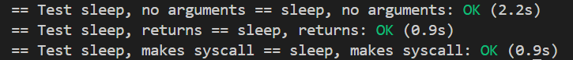

#### 其他说明
过程中使用了atoi函数，当输入为sleep abcd等非数字输入时，ticks=0，也就是说等效于sleep 0

<br>    

### pingpong的实现
#### 实验思路
(pingpong.c)   
创建两个管道，父进程->子进程和子进程->父进程，创建子进程，分别处理父子进程的逻辑。


#### 核心代码
```c
int main(int argc, char *argv[]) {
......  
    if (pid == 0) {
        // 子进程
        close(parent_to_child[1]);  // 关闭写端
        close(child_to_parent[0]);  // 关闭读端
        
        // 从父进程读取数据
        if (read(parent_to_child[0], &buf, 1) != 1) {
            fprintf(2, "Error: child read failed\n");
            exit(1);
        }
        
        // 打印消息
        printf("%d: received ping\n", getpid());
        
        // 向父进程发送数据
        if (write(child_to_parent[1], &buf, 1) != 1) {
            fprintf(2, "Error: child write failed\n");
            exit(1);
        }
        
        // 关闭管道
        close(parent_to_child[0]);
        close(child_to_parent[1]);
        exit(0);
    } else {
        // 父进程
        close(parent_to_child[0]);  // 关闭读端
        close(child_to_parent[1]);  // 关闭写端
        
        // 向子进程发送数据
        if (write(parent_to_child[1], &buf, 1) != 1) {
            fprintf(2, "Error: parent write failed\n");
            exit(1);
        }
        
        // 从子进程读取数据
        if (read(child_to_parent[0], &buf, 1) != 1) {
            fprintf(2, "Error: parent read failed\n");
            exit(1);
        }
        
        // 打印消息
        printf("%d: received pong\n", getpid());
        
        // 关闭管道
        close(parent_to_child[1]);
        close(child_to_parent[0]);
        
        // 等待子进程结束
        wait(0);
        exit(0);
    }
}
```

#### 测试截图
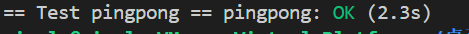

#### 其他说明
程序最后的wait(0)的作用是等待子进程结束后再退出父进程，保证资源的正确释放，防止子进程变成僵尸进程。   

<br>

### primes的实现
#### 实现思路
(primes.c)   
父进程输入2-280的所有整数，之后依次创建子进程，打印最小的数x(一定是素数)，并将剩下数中不是x的整数倍的数传给下一个进程。

### 核心代码
```c
int main(int argc, char *argv[]) {
    ......
    if (pid == 0) {
        // 子进程：作为第一个筛子
        close(p[1]);  // 关闭写端
        primes(p[0]); // 开始筛法递归
        exit(0);      
    } else {
        // 父进程：生成2-280的数字
        close(p[0]);  // 关闭读端
        
        // 生成2-280的数字并写入管道
        for (i = 2; i <= 280; i++) {
            if (write(p[1], &i, sizeof(int)) != sizeof(int)) {
                fprintf(2, "Error: write failed\n");
                exit(1);
            }
        }
        
        // 关闭写端，通知子进程没有更多数据
        close(p[1]);
        
        // 等待第一个筛子进程结束
        wait(0);
        exit(0);
    }
}

void primes(int fd) {
    int p, n;
    int new_pipe[2];
    
    // 读取第一个数，它是素数
    if (read(fd, &p, sizeof(int)) != sizeof(int)) {
        close(fd);
        return; // 没有数据可读，退出
    }
    
    // 输出当前素数
    printf("prime %d\n", p);
    
    ......

    if (pid == 0) {
        // 子进程：新的筛子
        close(fd);          // 关闭旧管道的读端
        close(new_pipe[1]); // 关闭新管道的写端
        primes(new_pipe[0]);// 递归处理新管道的输入
        close(new_pipe[0]); // 处理完毕后关闭
        exit(0);
    } else {
        // 父进程：筛选当前素数的倍数
        close(new_pipe[0]); // 关闭新管道的读端
        
        // 读取剩余数字，筛除当前素数的倍数
        while (read(fd, &n, sizeof(int)) == sizeof(int)) {
            if (n % p != 0) {
                // 不是当前素数的倍数，传递给下一个筛子
                if (write(new_pipe[1], &n, sizeof(int)) != sizeof(int)) {
                    fprintf(2, "Error: write failed\n");
                    close(fd);
                    close(new_pipe[1]);
                    exit(1);
                }
            }
        }
        
        // 关闭管道两端
        close(fd);
        close(new_pipe[1]);
        
        // 等待子进程结束
        wait(0);
    }
}

```

#### 测试截图
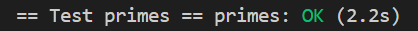

<br>

### find的实现
#### 实现思路
(find.c)   
递归的搜索每一层目录。搜索到的如果是文件，则比较文件名是否为所找文件名，如果是的则输出该文件路径；搜索到的如果是目录，则把该目录的名称拼接到路径中，并进入该目录进行搜索。

#### 核心代码
```c
void find(char *path, char *target)
{
    ......
    // 处理不同类型的文件
    switch(st.type){
    case T_FILE:
        // 如果是文件，检查文件名是否匹配
        if(strcmp(fmtname(path), target) == 0)
            printf("%s\n", path);
        break;
        
    case T_DIR:
        // 如果是目录，递归查找
        if(strlen(path) + 1 + DIRSIZ + 1 > sizeof buf){
            printf("find: path too long\n");
            break;
        }
        strcpy(buf, path);
        p = buf+strlen(buf);
        *p++ = '/';
        
        // 读取目录中的每个条目
        while(read(fd, &de, sizeof(de)) == sizeof(de)){
            if(de.inum == 0)
                continue;
                
            // 跳过 . 和 ..
            if(strcmp(de.name, ".") == 0 || strcmp(de.name, "..") == 0)
                continue;
                
            // 构建子路径
            memmove(p, de.name, DIRSIZ);
            p[DIRSIZ] = 0;
            
            // 获取子路径的文件信息
            if(stat(buf, &st) < 0){
                printf("find: cannot stat %s\n", buf);
                continue;
            }
            
            // 根据类型处理
            if(st.type == T_DIR)
                find(buf, target);
            else if(st.type == T_FILE)
                if(strcmp(de.name, target) == 0)
                    printf("%s\n", buf);
        }
        break;
    }
    close(fd);
}
```

#### 测试截图
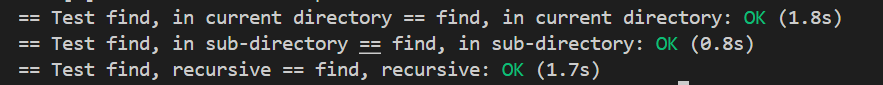


<br>

### xargs的实现
#### 实现思路
(xargs.c)   
从标准输入逐行读取数据。对于每一行数据，将其作为参数追加到用户指定的基础命令后，形成完整的待执行命令；随后创建子进程，通过exec执行该完整命令，并等待子进程完成后再处理下一行输入。期间需跳过xargs自身的选项参数（如-n 1），仅提取有效命令及初始参数，并为命令构建符合 xv6 文件系统要求的完整路径（在命令名前添加/前缀）。

#### 核心代码  
```c
int main(int argc, char *argv[]) {
    ......
    // 跳过 xargs 自身的选项（如 -n 1），直接找到命令名
    int cmd_start = 1;
    while (cmd_start < argc && strcmp(argv[cmd_start], "-n") == 0) {
        cmd_start += 2;  // 跳过 -n 和后面的数字参数
    }
    // 保存原命令及其参数
    char *cmd_args[MAXARG];
    int cmd_argc = argc - cmd_start;
    int i;
    // 复制原命令参数到cmd_args
    for (i = 0; i < cmd_argc; i++) {
        cmd_args[i] = argv[cmd_start + i];
    }
    
    ......
    // 从标准输入读取行
    while (1) {
        char c;
        int len = 0;
        int eof = 0;
        
        ......
        
        // 准备新的参数数组：原命令参数 + 新读取的行
        line_argc = 0;
        // 复制原命令参数
        for (i = 0; i < cmd_argc; i++) {
            line_args[line_argc++] = cmd_args[i];
        }
        // 添加新读取的行作为最后一个参数
        line_args[line_argc++] = line;
        line_args[line_argc] = 0;  // NULL结尾
        

        // 创建子进程执行命令
        pid = fork();
        if (pid < 0) {
            fprintf(2, "xargs: fork failed\n");
            exit(1);
        } else if (pid == 0) {
            // 子进程执行命令：手动构建完整路径（在命令名前加 "/"）
            char full_cmd[512];
            int j;
            
            full_cmd[0] = '/'; 
            
            // 复制命令名到路径中（从下标1开始）
            for (j = 0; cmd_args[0][j] != '\0' && j + 1 < sizeof(full_cmd) - 1; j++) {
                full_cmd[j + 1] = cmd_args[0][j];
            }
            
            full_cmd[j + 1] = '\0'; 
            
            // 执行命令
            if (exec(full_cmd, line_args) < 0) {
                fprintf(2, "xargs: exec %s failed\n", full_cmd);
                exit(1);
            }
        } else {
            wait(0);
        }
    }
    
    exit(0);
}
```

#### 测试截图
手动测试截图：   
.png "手动测试截图")    

自动测试截图：    
.png "自动测试截图")

### 心得体会
完成 xv6 的 utilities 实验，我亲手实现了 sleep、pingpong 等工具，明白了用户工具如何调用 OS 内核接口。如 pingpong 用双管道实现进程通信，primes 靠多进程链式筛素数，find 递归遍历文件系统。调试中解决管道阻塞、路径错误等问题，也加深了对进程管理、文件系统的理解。

<br>

## system calls实验 
### System call tracing 的实现
#### 实现思路
(user/user.h)  
添加trace函数原型声明，为用户空间提供调用trace系统调用的接口。

(user/usys.pl)  
添加entry("trace")，用于生成trace系统调用的汇编代码存根，实现用户空间到内核空间的切换。   

(kernel/syscall.h)  
定义SYS_trace为新的系统调用编号，为内核识别trace系统调用提供标识。   

(kernel/proc.h)  
在进程结构体struct proc中添加trace_mask字段，用于存储当前进程的系统调用追踪掩码。

(kernel/sysproc.c)  
实现sys_trace函数，从用户空间获取追踪掩码参数，并将其存储到当前进程的trace_mask字段中。

(kernel/proc.c)  
修改fork函数，在创建子进程时将父进程的trace_mask复制到子进程的对应字段，保证子进程继承系统调用追踪设置。  

(kernel/syscall.c)  
首先添加系统调用名称数组syscall_names，为每个系统调用编号关联对应的名称；然后修改syscall函数，在系统调用执行完毕后，检查当前进程的trace_mask，若对应系统调用位被设置，则打印包含进程 ID、系统调用名称和返回值的追踪信息。

#### 核心代码
```c
syscall.c文件
void
syscall(void) {
  int num;
  struct proc *p = myproc();

  num = p->trapframe->a7;
  if(num > 0 && num < NELEM(syscalls) && syscalls[num]) {
    p->trapframe->a0 = syscalls[num]();  // 执行系统调用
    
    // 检查掩码并打印追踪信息
    if(p->trace_mask & (1 << num)) {
      printf("%d: syscall %s -> %d\n",
             p->pid,
             num < NELEM(syscall_names) ? syscall_names[num] : "unknown",
             p->trapframe->a0);
    }
  } else {
    printf("%d: unknown sys call %d\n",
            p->pid, num);
    p->trapframe->a0 = -1;
  }
}


sysproc.c文件
uint64
sys_trace(void) {
  int mask;
  if(argint(0, &mask) < 0)
    return -1;
  myproc()->trace_mask = mask;
  return 0;
}
```

#### 测试截图
追踪read，追踪全部，不追踪的测试截图：  
.png "测试截图1")

trace 2 usertests forkforkfork部分结果：    
.png "测试截图2")

#### 其他
在make qemu时出现了意外报错，原因是sh.c 中的 runcmd 函数存在无限递归问题，解决方法为，将sh.c文件中的 
```c
if(cmd == 0)
    exit(1);
```
改为
```c
if(cmd == 0)
    return ;
```

具体报错信息如下：
```
user/sh.c: In function 'runcmd':
user/sh.c:58:1: error: infinite recursion detected [-Werror=infinite-recursion]
   58 | runcmd(struct cmd *cmd)
      | ^~~~~~
user/sh.c:89:5: note: recursive call
   89 |     runcmd(rcmd->cmd);
      |     ^~~~~~~~~~~~~~~~~
user/sh.c:109:7: note: recursive call
  109 |       runcmd(pcmd->left);
      |       ^~~~~~~~~~~~~~~~~~
user/sh.c:116:7: note: recursive call
  116 |       runcmd(pcmd->right);
      |       ^~~~~~~~~~~~~~~~~~~
user/sh.c:95:7: note: recursive call
   95 |       runcmd(lcmd->left);
      |       ^~~~~~~~~~~~~~~~~~
user/sh.c:97:5: note: recursive call
   97 |     runcmd(lcmd->right);
      |     ^~~~~~~~~~~~~~~~~~~
user/sh.c:127:7: note: recursive call
  127 |       runcmd(bcmd->cmd);
      |       ^~~~~~~~~~~~~~~~~
cc1: all warnings being treated as errors
make: *** [<内置>：user/sh.o] 错误 1
```
该报错后面多次出现，同样修改即可，此后不再赘述。

<br>

### Sysinfo的实现 
#### 实现思路
(user/user.h)   
添加 sysinfo 函数原型声明，并前置声明 struct sysinfo，为用户空间提供调用 sysinfo 系统调用的接口。

(user/usys.pl)  
添加 entry ("sysinfo")，用于生成 sysinfo 系统调用的汇编代码存根，实现用户空间到内核空间的切换。

(kernel/syscall.h)  
定义 SYS_sysinfo 为新的系统调用编号，为内核识别 sysinfo 系统调用提供标识。

(kernel/sysinfo.h)   
定义 struct sysinfo 结构体，包含 freemem（空闲内存字节数）和 nproc（非 UNUSED 状态进程数）字段。

(kernel/kalloc.c)   
实现 freemem 函数，遍历空闲内存链表，统计空闲内存的字节数。  

(kernel/proc.c)   
实现 nproc 函数，遍历进程表，统计状态不为 UNUSED 的进程数量。  

(kernel/sysproc.c)   
实现 sys_sysinfo 函数，先从用户空间获取 struct sysinfo 指针参数，然后填充该结构体的 freemem 和 nproc 字段，最后通过 copyout 函数将结构体复制回用户空间。  

(kernel/syscall.c)   
在系统调用表中注册 sys_sysinfo 函数，使内核能够识别并处理 sysinfo 系统调用。  

#### 核心代码
```c
user/user.h文件
struct sysinfo;  // 前置声明结构体
int sysinfo(struct sysinfo *);  // 系统调用原型

user/usys.pl文件 //添加系统调用汇编存根
entry("sysinfo");

kernel/syscall.h //定义系统调用编号
#define SYS_sysinfo 22  // 新增系统调用编号

kernel/sysinfo.h //定义sysinfo结构体
struct sysinfo {
  uint64 freemem;  // 空闲内存字节数
  uint64 nproc;    // 非UNUSED状态的进程数
};

kernel/kalloc.c //统计空闲内存
uint64
freemem(void) {
  struct run *r;
  uint64 count = 0;
  
  acquire(&kmem.lock);
  r = kmem.freelist;
  while(r) {
    count += PGSIZE;  // 每个空闲块大小为PGSIZE
    r = r->next;
  }
  release(&kmem.lock);
  
  return count;
}

kernel/proc.c //统计活跃进程
uint64
nproc(void) {
  struct proc *p;
  uint64 count = 0;
  
  for(p = proc; p < &proc[NPROC]; p++) {
    acquire(&p->lock);
    if(p->state != UNUSED) {
      count++;
    }
    release(&p->lock);
  }
  
  return count;
}

kernel/sysproc.c //实现sysinfo系统调用
uint64
sys_sysinfo(void) {
  struct sysinfo info;
  uint64 addr;  // 用户空间地址
  
  // 获取用户传入的结构体地址
  if(argaddr(0, &addr) < 0)
    return -1;
  
  // 填充sysinfo结构体
  info.freemem = freemem();
  info.nproc = nproc();
  
  // 将结构体复制到用户空间
  if(copyout(myproc()->pagetable, addr, (char*)&info, sizeof(info)) < 0)
    return -1;
  
  return 0;  // 成功返回0
}

kernel/syscall.c //注册系统调用
extern uint64 sys_sysinfo(void);

static uint64 (*syscalls[])(void) = {
  // ... 原有系统调用 ...
  [SYS_sysinfo] = sys_sysinfo,
};
```

#### 测试截图
手动测试截图：
.png "手动测试截图")  
自动测试截图：
.png "自动测试截图")  

### 心得体会
实现系统调用追踪和 sysinfo，让我理解了系统调用的完整流程：从用户态声明到内核态实现，再到参数传递与结果返回。调试中解决了进程状态统计、内存拷贝等问题，明白了进程控制块和系统调用表的作用，也体会到内核与用户态协作的严谨性。

<br>

## pgtbl实验
### Print a page table的实现
#### 实现思路
(kernel/defs.h)   
添加 vmprint 函数原型声明，为内核其他模块提供调用接口。

(kernel/vm.c)   
实现 vmprint 函数，该函数接收 pagetable_t 类型参数，打印页表信息。内部调用辅助函数递归遍历页表层级。

(kernel/vm.c)   
实现辅助函数 vmprintwalk，该函数递归遍历页表，根据层级深度打印缩进，显示有效 PTE 的索引、PTE 值和物理地址。对于指向更低层级页表的 PTE，递归调用自身处理。

(kernel/exec.c)   
在 exec 函数返回前，添加条件判断 if (p->pid==1) vmprint (p->pagetable)，用于打印第一个进程的页表信息。

#### 核心代码
```c
kernel/vm.c文件  //打印功能实现
// 递归打印页表
void vmprint(pagetable_t pagetable, int depth) {
  // 遍历页表中的每个条目 (512个PTE)
  for (int i = 0; i < 512; i++) {
    pte_t pte = pagetable[i];
    
    // 跳过无效的PTE
    if ((pte & PTE_V) == 0)
      continue;
    
    // 打印缩进 (根据深度)
    printf("..");
    for (int j = 1; j < depth; j++){
        printf(" ..");
    }
    printf("%d: pte %p pa %p\n", i, pte, PTE2PA(pte));
    
    // 如果是页目录项 (非叶子节点)，递归打印下一级页表
    if ((pte & (PTE_R | PTE_W | PTE_X)) == 0) {
      vmprint((pagetable_t)PTE2PA(pte), depth + 1);
    }
  }
}

// 对外接口，用于从其他文件调用
void vmprint_wrapper(pagetable_t pagetable) {
  printf("page table %p\n", pagetable);
  vmprint(pagetable, 1);
}

kernel/exec.c文件  //在函数int exec(char *path, char **argv) return前打印
if(p->pid == 1)  // 仅打印第一个进程的页表
    vmprint_wrapper(p->pagetable);
return argc;

kernel/defs.h文件 //添加函数申明
void            vmprint_wrapper(pagetable_t);
```

#### 测试截图
自动测试截图：   
.png "自动测试截图")
手动测试截图：  
.png "手动测试截图")

#### 问题回答
结合 RISC-V 页表结构（三级页表，对应 VPN [2]、VPN [1]、VPN [0]）：
输出中缩进 ".." 数量对应页表层级（1 级、2 级、3 级），仅打印有效 PTE（Valid 位为 1）。
页 0（VPN [0]=0）通常是用户程序的文本段（代码）。
页 2（VPN [0]=2）可能是数据段或堆。
页 1（VPN [0]=1）的 PTE 中写权限位（W）若为 1，用户态可读写；否则仅可读。示例中页 1 的 PTE 含 0xf，U位为0，故不可访问。

<br>

### A kernel page table per process的实现
#### 实现思路
(kernel/proc.h)   
在 struct proc 中添加 pagetable_t kernelpgtbl 字段，用于存储进程专属的内核页表。    

(kernel/vm.c)   
实现 kvm_map_pagetable 函数，为指定页表添加内核所需的固定映射（如 UART、PLIC、内核文本、trampoline 等），替代原 kvminit 中直接修改全局页表的逻辑。    
实现 kvminit_newpgtbl 函数，分配新页表并调用 kvm_map_pagetable 完成映射初始化，用于创建新进程的内核页表。     
修改 kvmmap 函数，增加 pagetable_t 参数，使其能为指定页表添加映射；修改 kvmpa 函数，增加 pagetable_t 参数，基于指定页表完成虚拟地址到物理地址的转换。     
实现 kvm_free_kernelpgtbl 函数，递归释放页表各级页表项所占用的内存（不释放叶节点指向的物理内存页），用于进程销毁时回收内核页表资源。   

(kernel/proc.c)    
修改 procinit 函数，移除预分配所有进程内核栈的逻辑，改为在进程创建时动态分配。    
在 allocproc 函数中，为新进程调用 kvminit_newpgtbl 创建内核页表；分配内核栈物理页，并通过 kvmmap 将其映射到进程内核页表的固定虚拟地址；设置 p->kstack 记录内核栈虚拟地址。     
修改 scheduler 函数，在切换到进程运行前，通过 w_satp 加载进程的 kernelpgtbl 到 satp 寄存器，并调用 sfence_vma 刷新 TLB；进程切换回调度器后，调用 kvminithart 恢复全局内核页表。    
在 freeproc 函数中，通过 kvmpa 获取内核栈物理地址并调用 kfree 释放；调用 kvm_free_kernelpgtbl 释放进程的内核页表。  

(kernel/virtio_disk.c)   
修改 virtio_disk_rw 函数中 kvmpa 的调用，传入当前进程的 kernelpgtbl（通过 myproc ()->kernelpgtbl），确保基于进程自身内核页表完成地址转换。

#### 核心代码
```c
kernel/vm.c文件//创建与释放页表函数实现
//为指定页表添加映射
void kvm_map_pagetable(pagetable_t pgtbl) {
  // 将各种内核需要的 direct mapping 添加到页表 pgtbl 中。
  
  // uart registers
  kvmmap(pgtbl, UART0, UART0, PGSIZE, PTE_R | PTE_W);

  // virtio mmio disk interface
  kvmmap(pgtbl, VIRTIO0, VIRTIO0, PGSIZE, PTE_R | PTE_W);

  // CLINT
  kvmmap(pgtbl, CLINT, CLINT, 0x10000, PTE_R | PTE_W);

  // PLIC
  kvmmap(pgtbl, PLIC, PLIC, 0x400000, PTE_R | PTE_W);

  // map kernel text executable and read-only.
  kvmmap(pgtbl, KERNBASE, KERNBASE, (uint64)etext-KERNBASE, PTE_R | PTE_X);

  // map kernel data and the physical RAM we'll make use of.
  kvmmap(pgtbl, (uint64)etext, (uint64)etext, PHYSTOP-(uint64)etext, PTE_R | PTE_W);

  // map the trampoline for trap entry/exit to
  // the highest virtual address in the kernel.
  kvmmap(pgtbl, TRAMPOLINE, (uint64)trampoline, PGSIZE, PTE_R | PTE_X);
}

pagetable_t
kvminit_newpgtbl()
{
  pagetable_t pgtbl = (pagetable_t) kalloc();
  memset(pgtbl, 0, PGSIZE);

  kvm_map_pagetable(pgtbl);

  return pgtbl;
}

// 递归释放一个内核页表中的所有 mapping，但是不释放其指向的物理页
void
kvm_free_kernelpgtbl(pagetable_t pagetable)
{
  // there are 2^9 = 512 PTEs in a page table.
  for(int i = 0; i < 512; i++){
    pte_t pte = pagetable[i];
    uint64 child = PTE2PA(pte);
    if((pte & PTE_V) && (pte & (PTE_R|PTE_W|PTE_X)) == 0){ // 如果该页表项指向更低一级的页表
      // 递归释放低一级页表及其页表项
      kvm_free_kernelpgtbl((pagetable_t)child);
      pagetable[i] = 0;
    }
  }
  kfree((void*)pagetable); // 释放当前级别页表所占用空间
}

kernel/proc.c文件//调用vm.c中函数创建和释放内核页表
//创建新进程
static struct proc*
allocproc(void) 
{
  struct proc *p;

  ......

  // 为新进程创建独立的内核页表，并将内核所需要的各种映射添加到新页表上
  p->kernelpgtbl = kvminit_newpgtbl();
  // printf("kernel_pagetable: %p\n", p->kernelpgtbl);

  // 分配一个物理页，作为新进程的内核栈使用
  char *pa = kalloc();
  if(pa == 0)
    panic("kalloc");
  uint64 va = KSTACK((int)0); // 将内核栈映射到固定的逻辑地址上
  // printf("map krnlstack va: %p to pa: %p\n", va, pa);
  kvmmap(p->kernelpgtbl, va, (uint64)pa, PGSIZE, PTE_R | PTE_W);
  p->kstack = va;

  ......

  return p;
}

//进程调度
void
scheduler(void)
{
  struct proc *p;
  struct cpu *c = mycpu();
  
  c->proc = 0;
  for(;;){
    // Avoid deadlock by ensuring that devices can interrupt.
    intr_on();
    
    int found = 0;
    for(p = proc; p < &proc[NPROC]; p++) {
      acquire(&p->lock);
      if(p->state == RUNNABLE) {
        ......

        // 切换到进程独立的内核页表
        w_satp(MAKE_SATP(p->kernelpgtbl));
        sfence_vma(); // 清除快表缓存

        swtch(&c->context, &p->context);

        // 切换回全局内核页表
        kvminithart();

        ......
      }
      release(&p->lock);
    }
  ......
  }
}


//释放进程
static void
freeproc(struct proc *p)
{
  ......

  // 释放进程的内核栈
  void *kstack_pa = (void *)kvmpa(p->kernelpgtbl, p->kstack);
  // printf("trace: free kstack %p\n", kstack_pa);
  kfree(kstack_pa);
  p->kstack = 0;

  // 递归释放进程独享的页表，释放页表本身所占用的空间
  kvm_free_kernelpgtbl(p->kernelpgtbl);
  p->kernelpgtbl = 0;

  p->state = UNUSED;
}
```

#### 测试截图
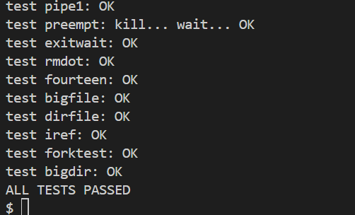

#### 其他
实验测试时发现，kernel/virtio_disk.c文件也调用了kvmpa函数，我们需要也对其进行相应的参数修改。
```c
#include "proc.h" // 添加头文件引入

disk.desc[idx[0]].addr = (uint64) kvmpa(myproc()->kernelpgtbl, (uint64) &buf0);
```

<br>

### Simplify copyin/copyinstr的实现
#### 实现思路
(kernel/vm.c) （PS:defs.h文件中函数声明同步修改）   
实现 kvmcopymappings 函数，将源页表（用户页表）中 [start, start+sz) 范围的映射复制到目标页表（进程内核页表），复制时清除 PTE_U 权限（确保内核可访问），失败时回滚已添加的映射。  
实现 kvmdealloc 函数，根据新旧内存大小差异，删除内核页表中超出新大小的映射（仅删除映射，不释放物理页），保持与用户页表的同步收缩。  
修改 kvm_map_pagetable 函数，移除 CLINT 设备的映射（避免与用户地址范围 [0, PLIC) 冲突），仅保留 UART、VIRTIO、PLIC 等必要设备映射。  
修改 kvminit 函数，在全局内核页表中单独添加 CLINT 映射（满足内核启动需求）。  
替换 copyin 和 copyinstr 函数的实现，改为转发到 copyin_new 和 copyinstr_new，依赖内核页表中的用户映射直接访问用户内存。  

(kernel/proc.c)  
在 fork 函数中，复制用户页表后，调用 kvmcopymappings 将子进程用户页表的映射同步到其内核页表，确保子进程内核页表与用户页表一致。  
修改 growproc 函数，扩展内存时通过 kvmcopymappings 同步新增的用户映射到内核页表（失败时回滚用户页表）；收缩内存时通过 kvmdealloc 同步删除内核页表中多余的映射。  
在 userinit 函数中，初始化第一个进程（init）的用户页表后，调用 kvmcopymappings 将初始用户映射同步到其内核页表（因 init 进程非 fork 创建，需单独处理）。  

(kernel/exec.c)  
在 exec 函数加载新程序时，添加检查确保程序内存大小 sz 不超过 PLIC 地址（sz < PLIC），防止用户地址与内核地址重叠。
加载新程序后，先通过 uvmunmap 清除内核页表中旧程序的用户映射，再调用 kvmcopymappings 将新程序的用户映射同步到内核页表，确保内核页表与新用户页表一致。


#### 核心代码
```c
vm.c文件
// 声明新函数原型
int copyin_new(pagetable_t pagetable, char *dst, uint64 srcva, uint64 len);
int copyinstr_new(pagetable_t pagetable, char *dst, uint64 srcva, uint64 max);


int
copyin(pagetable_t pagetable, char *dst, uint64 srcva, uint64 len)
{
  return copyin_new(pagetable,dst,srcva,len);
}


int
copyinstr(pagetable_t pagetable, char *dst, uint64 srcva, uint64 max)
{
  return copyinstr_new(pagetable,dst,srcva,max);
}


//将用户页表（src）中的地址映射复制到内核页表（dst）中
int
kvmcopymappings(pagetable_t src, pagetable_t dst, uint64 start, uint64 sz)
{
  pte_t *pte;
  uint64 pa, i;
  uint flags;

  // PGROUNDUP(start):用于将start地址向上舍入到页边界，防止重复映射已存在页面
  for(i = PGROUNDUP(start); i < start + sz; i += PGSIZE){
    if((pte = walk(src, i, 0)) == 0)
      panic("kvmcopymappings: pte should exist");
    if((*pte & PTE_V) == 0)
      panic("kvmcopymappings: page not present");
    pa = PTE2PA(*pte);
    // `& ~PTE_U` 表示将该页的权限设置为非用户页
    // 必须设置该权限，RISC-V 中内核是无法直接访问用户页的。
    flags = PTE_FLAGS(*pte) & ~PTE_U;
    if(mappages(dst, i, PGSIZE, pa, flags) != 0){
      goto err;
    }
  }

  return 0;

 err:
  uvmunmap(dst, PGROUNDUP(start), (i - PGROUNDUP(start)) / PGSIZE, 0);
  return -1;
}

//释放内核页表中不再需要的用户地址映射
uint64
kvmdealloc(pagetable_t pagetable, uint64 oldsz, uint64 newsz)
{
  if(newsz >= oldsz)
    return oldsz;

  if(PGROUNDUP(newsz) < PGROUNDUP(oldsz)){
    int npages = (PGROUNDUP(oldsz) - PGROUNDUP(newsz)) / PGSIZE;
    uvmunmap(pagetable, PGROUNDUP(newsz), npages, 0);
  }

  return newsz;
}

proc.c文件
// Set up first user process.
void
userinit(void)
{
  ......  
  // allocate one user page and copy init's instructions
  // and data into it.
  uvminit(p->pagetable, initcode, sizeof(initcode));
  p->sz = PGSIZE;
  kvmcopymappings(p->pagetable, p->kernelpgtbl, 0, p->sz); // 同步程序内存映射到进程内核页表中
  ......
}

int
growproc(int n)
{
  uint sz;
  struct proc *p = myproc();

  sz = p->sz;
  if(n > 0){
    uint64 newsz;
    if((newsz = uvmalloc(p->pagetable, sz, sz + n)) == 0) {
      return -1;
    }
    if(kvmcopymappings(p->pagetable, p->kernelpgtbl, sz, n) != 0) {
      uvmdealloc(p->pagetable, newsz, sz);
      return -1;
    }
    sz = newsz;
  } else if(n < 0){
    uvmdealloc(p->pagetable, sz, sz + n);
    sz = kvmdealloc(p->kernelpgtbl, sz, sz + n);
  }
  p->sz = sz;
  return 0;
}


int
fork(void)
{
  ......
  // Copy user memory from parent to child.
  if(uvmcopy(p->pagetable, np->pagetable, p->sz) < 0 ||
     kvmcopymappings(np->pagetable, np->kernelpgtbl, 0, p->sz) < 0){
    freeproc(np);
    release(&np->lock);
    return -1;
  }
  np->sz = p->sz;
  ......
}

exec.c文件
int
exec(char *path, char **argv)
{
  ......
 // 清除内核页表中对程序内存的旧映射，然后重新建立映射。
  uvmunmap(p->kernelpgtbl, 0, PGROUNDUP(oldsz)/PGSIZE, 0);
  kvmcopymappings(pagetable, p->kernelpgtbl, 0, sz);
  ......
}
```

#### 测试截图
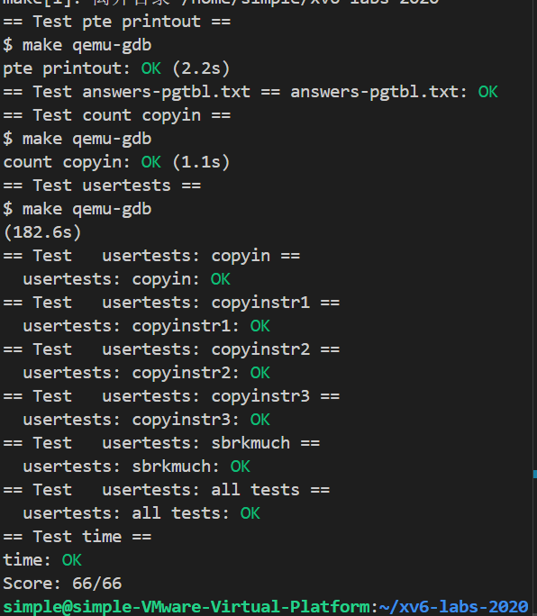


### 心得体会
通过此次 pgtbl 实验，我摸清了 RISC-V 页表机制与内核内存管理逻辑。实现页表打印时，递归遍历三级页表项，直观看到虚拟地址到物理地址的映射层级；为进程创建专属内核页表，需动态映射内核资源、调度时切换页表并刷新 TLB；简化 copyin 则通过同步用户与内核页表映射，让内核直接访问用户内存。调试中解决了地址冲突、页表释放等问题，深刻理解进程内存隔离的意义，对虚拟内存机制的理解也更近一步了。

## traps实验
### Q&A
Q:Which registers contain arguments to functions? For example, which register holds 13 in main's call to printf?  
A:a0-a7;a2.

Q:Where is the call to function f in the assembly code for main? Where is the call to g? (Hint: the compiler may inline functions.)  
A:没有直接调用，g()函数内联到f()函数，f()函数又内联到main()函数

Q:At what address is the function printf located?  
A:0x0000000000000616, main 中使用 pc 相对寻址来计算得到这个地址。

Q:What value is in the register ra just after the jalr to printf in main?  
A:0x0000000000000038, jalr 指令的下一条汇编指令的地址。


Q:Run the following code.

	unsigned int i = 0x00646c72;
	printf("H%x Wo%s", 57616, &i);
      
What is the output? Here's an ASCII table that maps bytes to characters.
The output depends on that fact that the RISC-V is little-endian. If the RISC-V were instead big-endian what would you set to in order to yield the same output? Would you need to change to a different value?i57616  
A:输出为""He110 World"。big-endian时，i应该设置为 0x726c6400。

Q:In the following code, what is going to be printed after ? (note: the answer is not a specific value.) Why does this happen? 'y='  
	printf("x=%d y=%d", 3);  
A:输出的是一个受调用前的代码影响的“未知”的值。
  因为 printf 尝试读的参数数量比提供的参数数量多，第二个参数 `3` 通过 a1 传递，而第三个参数对应的寄存器 a2 在调用前不会被设置为任何具体的值，而是会包含调用发生前的已经在里面的值，看起来就像是输出了一个随机的，未知的值。

### Backtrace的实现
#### 实现思路
(kernel/defs.h)  
添加 backtrace 函数声明，供其他文件调用。

(kernel/riscv.h)  
实现 r_fp 函数，通过内联汇编获取当前帧指针寄存器（s0）的值，用于定位栈帧起始地址。

(kernel/printf.c)  
实现 backtrace 函数：  
调用 r_fp 获取当前帧指针（FP）。  
循环遍历栈帧：从当前 FP 中提取返回地址（FP-8 位置）并打印；更新 FP 为上一级栈帧的 FP（FP-16 位置）。  
终止条件：当 FP 到达栈底（FP 等于其所在页的上界，即 PGROUNDUP(fp)）时停止遍历。   

(kernel/sysproc.c)  
在 sys_sleep 函数开头调用 backtrace，触发调用栈打印，用于测试回溯功能。

#### 核心代码
```c
riscv.h文件
static inline uint64
r_fp()
{
  uint64 x;
  asm volatile("mv %0, s0" : "=r" (x));
  return x;
}

printf.c文件
//回溯追踪
void backtrace() {
  uint64 fp = r_fp();
  printf("backtrace:\n");
  while(fp != PGROUNDUP(fp)) { // 如果已经到达栈底
    uint64 ra = *(uint64*)(fp - 8); // return address
    printf("%p\n", ra);
    fp = *(uint64*)(fp - 16); // previous fp
  }
}
```

#### 测试截图
.png "测试截图1")
.png "测试截图2")

### alarm的实现
#### 实现思路
(kernel/proc.h)   
在struct proc中添加闹钟相关字段：alarm_interval（时钟周期）、alarm_handler（回调函数）、alarm_ticks（剩余 ticks 数）、alarm_trapframe（保存中断时的陷阱帧）、alarm_goingoff（防重入标志）。   

(kernel/proc.c)   
在allocproc函数中为进程分配alarm_trapframe内存，并初始化所有闹钟字段（alarm_interval=0、alarm_handler=0等）；在freeproc函数中释放alarm_trapframe内存，重置闹钟字段，确保进程生命周期内资源正确管理。 

(user/user.h)  
添加sigalarm和sigreturn函数声明，供用户程序调用：int sigalarm(int ticks, void (*handler)());和int sigreturn(void);。  

(kernel/sysproc.c)   
实现sys_sigalarm：调用sigalarm函数设置进程的闹钟字段。   
实现sys_sigreturn：调用sigreturn函数恢复中断前的陷阱帧。  

(kernel/trap.c)  
实现sigalarm函数：将用户参数赋值给当前进程的闹钟字段，初始化alarm_ticks为alarm_interval。   
实现sigreturn函数：将alarm_trapframe中保存的上下文恢复到当前trapframe，重置防重入标志，完成闹钟处理后的状态恢复。   
修改usertrap函数，在定时器中断（which_dev == 2）时，检查进程是否设置闹钟（alarm_interval != 0）：进行相应处理。无论是否触发闹钟，均调用yield让出 CPU，保证时钟公平性。

#### 核心代码
```c
proc.h文件
struct proc {
  ......
//alarm相关字段
  int alarm_interval;          // 时钟周期，0表示禁用
  void(*alarm_handler)();      // 时钟回调处理函数
  int alarm_ticks;             //下一次时钟响起前还剩下的 ticks 数
  struct trapframe *alarm_trapframe;  // 时钟中断时刻的 trapframe，用于中断处理完成后恢复原程序的正常执行
  int alarm_goingoff;  //是否已经有一个时钟回调正在执行且还未返回，防止alarm_handle重复执行
}

proc.c文件
static struct proc*
allocproc(void)
{ 
  ......
  //为 alarm_trapframe 分配一个陷阱帧
  if((p->alarm_trapframe = (struct trapframe *)kalloc()) == 0){
    release(&p->lock);
    return 0;
  }

  p->alarm_interval = 0;
  p->alarm_handler = 0;
  p->alarm_ticks = 0;
  p->alarm_goingoff = 0;
}

static void
freeproc(struct proc *p)
{
  ......

  if(p->alarm_trapframe)
    kfree((void*)p->alarm_trapframe);
  p->alarm_trapframe = 0;

  ......

  p->alarm_interval = 0;
  p->alarm_handler = 0;
  p->alarm_ticks = 0;
  p->alarm_goingoff = 0;

  ......
}

sysproc.c文件
//sigalarm系统调用
uint64 sys_sigalarm(void) {
  int n;
  uint64 fn;
  if(argint(0, &n) < 0)
    return -1;
  if(argaddr(1, &fn) < 0)
    return -1;
  
  return sigalarm(n, (void(*)())(fn));
}

//sigreturn系统调用
uint64 sys_sigreturn(void) {
	return sigreturn();
}

user.h文件
int sigalarm(int ticks, void (*handler)());  
int sigreturn(void);  

trap.c文件
//设置进程闹钟
int sigalarm(int ticks, void(*handler)()) {
  // 设置 myproc 中的相关属性
  struct proc *p = myproc();
  p->alarm_interval = ticks;
  p->alarm_handler = handler;
  p->alarm_ticks = ticks;
  return 0;
}

//恢复进程状态
int sigreturn() {
  // 将 trapframe 恢复到时钟中断之前的状态，恢复原本正在执行的程序流
  struct proc *p = myproc();
  *p->trapframe = *p->alarm_trapframe;
  p->alarm_goingoff = 0;
  return 0;
}

void
usertrap(void)
{
  ......

  if(p->killed)
    exit(-1);

  // 闹钟实现并让出CPU
  if(which_dev == 2) {
    if(p->alarm_interval != 0) { // 如果设定了时钟事件
      if(--p->alarm_ticks <= 0) { // 时钟倒计时 -1 tick，如果已经到达或超过设定的 tick 数
        if(!p->alarm_goingoff) { // 确保当前没有时钟正在运行
          p->alarm_ticks = p->alarm_interval;//重置时钟倒计时
          *p->alarm_trapframe = *p->trapframe; // 保存当前进程状态
          p->trapframe->epc = (uint64)p->alarm_handler;//执行处理函数
          p->alarm_goingoff = 1;
        }
        // 如果一个时钟到期的时候已经有一个时钟处理函数正在运行，则会推迟到原处理函数运行完成后的下一个 tick 才触发这次时钟
      }
    }
    yield();
  }
  ......
}
```

#### 测试截图
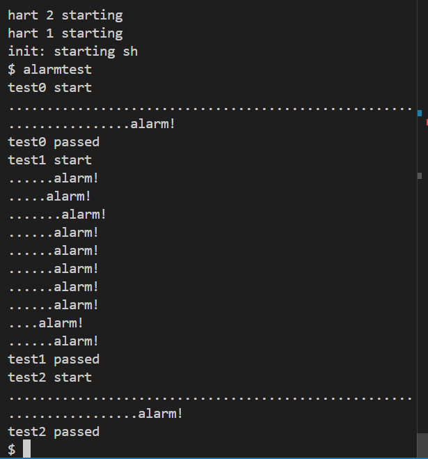

#### 其他
由于进行了系统调用，需要对usys.pl文件、syscall.h文件、syscall.c文件进行相对应修改。比如usys.pl文件要添加
```c
entry("sigalarm"); 
entry("sigreturn");
```
同时，需要将alarmtest加入到Makefile中保证编译，才能正常进行测试。

### 心得体会
完成此次 traps 实验，我理解了中断与异常处理机制。=感受了寄存器传参、函数调用及大小端存储等细节。实现 backtrace 时，利用帧指针递归获取返回地址，清晰呈现函数调用链。实现 alarm 时，在进程结构体添加闹钟字段，定时器定时器中断触发回调，需处理状态保存与恢复，防止重入。调试中解决了陷阱帧同步、中断重入等问题，了解到内核异常的处理机制，也提升了对系统中断响应流程的认知。


## lazy实验

### Eliminate allocation from sbrk()的实现

#### 实现思路
(kernel/sysproc.c)
修改sysbark代码，进行懒分配，即只增加进程的内存大小限制而不分配物理内存。

#### 核心代码
```c
sysproc.c文件
uint64
sys_sbrk(void)
{
  int addr;
  int n;
  struct proc *p = myproc();
  if(argint(0, &n) < 0)
    return -1;
  addr = p->sz;
  if(n < 0) {
    uvmdealloc(p->pagetable, p->sz, p->sz+n); // 如果是缩小空间，则马上释放
  }
  p->sz += n; // 懒分配
  return addr;
}
```

#### 测试截图
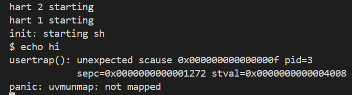

#### 结果分析
scause 0x0f 表示这是一个用户态指令访问错误（Instruction Fetch Fault）。  
stval=0x4008 是触发错误的虚拟地址。  
pte=0x0 说明该地址对应的页表项（PTE）为空，即没有映射到物理内存。   
也就是说，当 shell 执行echo hi时，它需要分配内存来存储命令和执行程序，但由于sbrk()不再分配物理页，访问这些内存时触发了页错误。

### Lazy allocation的实现
#### 实现思路
(kernel/trap.c)  
修改 usertrap 函数，在处理用户态异常时检测缺页异常（r_scause () 为 13 或 15），并通过 uvmshouldtouch 判断是否为需要懒分配的地址，若是则调用 uvmlazytouch 分配物理内存并建立映射，否则杀死进程。

(kernel/vm.c)  
实现 uvmlazytouch 函数，为指定虚拟地址分配物理页并映射到页表，设置正确权限位。    
实现 uvmshouldtouch 函数，检查地址是否在进程内存范围内、是否为栈保护页、是否未映射。  
修改 uvmunmap 函数，使其在遇到未映射的页表项时不再 panic，而是跳过这些页，确保进程退出或释放内存时能正确处理未映射的页。

#### 核心代码
```c
vm.c文件
//添加所需头文件
#include "spinlock.h"  
#include "proc.h" 

//懒分配地址
void uvmlazytouch(uint64 va) {
  struct proc *p = myproc();
  char *mem = kalloc();
  if(mem == 0) {
    // failed to allocate physical memory
    printf("lazy alloc: out of memory\n");
    p->killed = 1;
  } else {
    memset(mem, 0, PGSIZE);
    if(mappages(p->pagetable, PGROUNDDOWN(va), PGSIZE, (uint64)mem, PTE_W|PTE_X|PTE_R|PTE_U) != 0){
      printf("lazy alloc: failed to map page\n");
      kfree(mem);
      p->killed = 1;
    }
  }
  // printf("lazy alloc: %p, p->sz: %p\n", PGROUNDDOWN(va), p->sz);
}

//判断是否为需要懒分配的地址
int uvmshouldtouch(uint64 va) {
  pte_t *pte;
  struct proc *p = myproc();
  
  return va < p->sz // within size of memory for the process
    && PGROUNDDOWN(va) != r_sp() // not accessing stack guard page (it shouldn't be mapped)
    && (((pte = walk(p->pagetable, va, 0))==0) || ((*pte & PTE_V)==0)); // page table entry does not exist
}

//修改，跳过部分panic检查
void
uvmunmap(pagetable_t pagetable, uint64 va, uint64 npages, int do_free)
{
  uint64 a;
  pte_t *pte;

  if((va % PGSIZE) != 0)
    panic("uvmunmap: not aligned");

  for(a = va; a < va + npages*PGSIZE; a += PGSIZE){
    if((pte = walk(pagetable, a, 0)) == 0)
      //panic("uvmunmap: walk");
      continue;
    if((*pte & PTE_V) == 0)
      //panic("uvmunmap: not mapped");
      continue;
    if(PTE_FLAGS(*pte) == PTE_V)
      panic("uvmunmap: not a leaf");
    if(do_free){
      uint64 pa = PTE2PA(*pte);
      kfree((void*)pa);
    }
    *pte = 0;
  }
}

trap.c文件
void
usertrap(void)
{
  ......
  
  if(r_scause() == 8){
    
    ......

    syscall();
  } else if((which_dev = devintr()) != 0){
    // ok
  } else {
    uint64 va = r_stval();
    if((r_scause() == 13 || r_scause() == 15) && uvmshouldtouch(va)){ // 缺页异常，并且发生异常的地址进行过懒分配
      uvmlazytouch(va); // 分配物理内存，并在页表创建映射
    } 
    else { // 如果不是缺页异常，或者是在非懒加载地址上发生缺页异常，则抛出错误并杀死进程
      printf("usertrap(): unexpected scause %p pid=%d\n", r_scause(), p->pid);
      printf("            sepc=%p stval=%p\n", r_sepc(), r_stval());
      p->killed = 1;
    }
  }

  ......

}
```

#### 测试截图
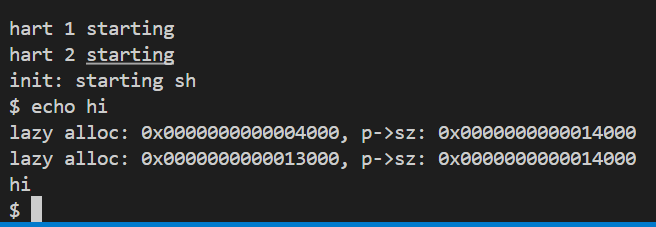 

### Lazytests and Usertests
#### 实现思路
(kernel/vm.c)
修改 uvmcopy 函数，在 fork 时复制父进程页表：仅复制已映射的页（PTE_V 有效），对未映射的懒分配页不处理，子进程访问时自行触发页错误并分配，确保父子进程内存拷贝正确。
修改 copyout 和 copyin 函数：在访问用户地址前，通过 uvmshouldtouch 检查是否为未分配的懒加载地址，若是则调用 uvmlazytouch 分配物理内存并映射，确保系统调用（如 read、write）能正确访问未预分配的内存。

#### 核心代码
```c
//修改，跳过部分panic检查
int
uvmcopy(pagetable_t old, pagetable_t new, uint64 sz)
{
  pte_t *pte;
  uint64 pa, i;
  uint flags;
  char *mem;

  for(i = 0; i < sz; i += PGSIZE){
    if((pte = walk(old, i, 0)) == 0)
      //panic("uvmcopy: pte should exist");
      continue;
    if((*pte & PTE_V) == 0)
      //panic("uvmcopy: page not present");
      continue;
    pa = PTE2PA(*pte);
    flags = PTE_FLAGS(*pte);
    if((mem = kalloc()) == 0)
      goto err;
    memmove(mem, (char*)pa, PGSIZE);
    if(mappages(new, i, PGSIZE, (uint64)mem, flags) != 0){
      kfree(mem);
      goto err;
    }
  }
  return 0;

 err:
  uvmunmap(new, 0, i / PGSIZE, 1);
  return -1;
}

int
copyout(pagetable_t pagetable, uint64 dstva, char *src, uint64 len)
{
  uint64 n, va0, pa0;

  if(uvmshouldtouch(dstva))
  uvmlazytouch(dstva);

  ......

}

// Copy from user to kernel.
// Copy len bytes to dst from virtual address srcva in a given page table.
// Return 0 on success, -1 on error.
int
copyin(pagetable_t pagetable, char *dst, uint64 srcva, uint64 len)
{
  uint64 n, va0, pa0;

  if(uvmshouldtouch(srcva))
  uvmlazytouch(srcva);

  ......

}
```

#### 测试截图
lazytests测试截图
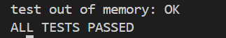

usertests测试截图
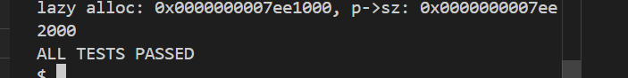

### 心得体会
完成 lazy 实验，我掌握了延迟内存分配的核心逻辑。修改 sys_sbrk 仅扩进程内存上限不分配物理页，待缺页异常时再通过 usertrap 触发 uvmlazytouch 分配映射。为适配懒分配，还需修改 uvmunmap 跳过未映射页、uvmcopy 仅复制已映射页，以及 copyin/out 预分配内存。调试中解决了栈保护页误判、跨页拷贝未分配等问题，深刻理解 “按需分配” 对内存效率的提升，也体会到内核需在异常处理、资源同步间平衡。

## cow实验
### cow的实现
#### 实现思路
(kernel/riscv.h)  
定义 PTE_COW 标志位（如 #define PTE_COW (1L << 8)），用于标识写时复制的懒复制页。

(kernel/vm.c)  
修改 uvmcopy 函数，在复制父进程内存到子进程时不实际复制数据，而是建立指向父进程物理页的映射，将父子进程的页表项均设为不可写并添加 PTE_COW 标志，同时调用 krefpage 增加物理页引用计数。      
实现 uvmcheckcowpage 函数，检查该页是否为有效懒复制页。   
实现 uvmcowcopy 函数，通过 kcopy_n_deref 为 COW 页分配新物理页并复制内容，解除原页映射后将新页映射为可写并清除 PTE_COW 标志。    
修改 copyout 函数，对写入的目标地址先检查是否为 COW 页，若是则调用 uvmcowcopy 处理。

(kernel/trap.c)  
修改 usertrap 函数，当异常原因为 13 或 15（缺页异常）且 uvmcheckcowpage 验证为 COW 页时，调用 uvmcowcopy 处理，若失败则标记进程为 killed。

(kernel/kalloc.c)   
定义 pageref 数组记录物理页引用计数和 pgreflock 锁保护计数操作。    
修改 kalloc 函数，分配新页时将引用计数初始化为 1。    
修改 kfree 函数，释放页时先减少引用计数，仅当计数为 0 时回收页内存。   
实现 krefpage 函数为物理页引用计数加 1。   
实现 kcopy_n_deref 函数，若物理页引用计数≤1 则返回原页，否则分配新页复制内容并减少原页引用计数后返回新页。

#### 核心代码
```c
vm.c文件
int
uvmcopy(pagetable_t old, pagetable_t new, uint64 sz)
{
  pte_t *pte;
  uint64 pa, i;
  uint flags;

  for(i = 0; i < sz; i += PGSIZE){
    if((pte = walk(old, i, 0)) == 0)
      panic("uvmcopy: pte should exist");
    if((*pte & PTE_V) == 0)
      panic("uvmcopy: page not present");
    pa = PTE2PA(*pte);
    if(*pte & PTE_W) {
      // 清除父进程的 PTE_W 标志位，设置 PTE_COW 标志位表示是一个懒复制页（多个进程引用同个物理页）
      *pte = (*pte & ~PTE_W) | PTE_COW;
    }
    flags = PTE_FLAGS(*pte);
    // if((mem = kalloc()) == 0)
    //   goto err;
    // memmove(mem, (char*)pa, PGSIZE);
    if(mappages(new, i, PGSIZE, (uint64)pa, flags) != 0){
      //kfree(mem);
      goto err;
    }
    // 将物理页的引用次数增加 1
    krefpage((void*)pa);
  }
  return 0;

//检测该页是否为懒复制页
int uvmcheckcowpage(uint64 va) {
  pte_t *pte;
  struct proc *p = myproc();
  
  return va < p->sz // 在进程内存范围内
    && ((pte = walk(p->pagetable, va, 0))!=0)
    && (*pte & PTE_V) // 页表项存在
    && (*pte & PTE_COW); // 页是一个懒复制页
}

// 实复制一个懒复制页，并重新映射为可写
int uvmcowcopy(uint64 va) {
  pte_t *pte;
  struct proc *p = myproc();

  if((pte = walk(p->pagetable, va, 0)) == 0)
    panic("uvmcowcopy: walk");
  
  // 调用 kalloc.c 中的 kcopy_n_deref 方法，复制页
  // (如果懒复制页的引用已经为 1，则不需要重新分配和复制内存页，只需清除 PTE_COW 标记并标记 PTE_W 即可)
  uint64 pa = PTE2PA(*pte);
  uint64 new = (uint64)kcopy_n_deref((void*)pa); // 将一个懒复制的页引用变为一个实复制的页
  if(new == 0)
    return -1;
  
  // 重新映射为可写，并清除 PTE_COW 标记
  uint64 flags = (PTE_FLAGS(*pte) | PTE_W) & ~PTE_COW;
  uvmunmap(p->pagetable, PGROUNDDOWN(va), 1, 0);
  if(mappages(p->pagetable, va, 1, new, flags) == -1) {
    panic("uvmcowcopy: mappages");
  }
  return 0;
}

int
copyout(pagetable_t pagetable, uint64 dstva, char *src, uint64 len)
{
  uint64 n, va0, pa0;

  while(len > 0){
    if(uvmcheckcowpage(dstva)) // 检查每一个被写的页是否是 COW 页
      uvmcowcopy(dstva);
    ......
  }
  return 0;
}

trap.c文件
void
usertrap(void)
{
  ......
  
  if(r_scause() == 8){
    ......
  } else if((which_dev = devintr()) != 0){
    // ok
  } else if((r_scause() == 13 || r_scause() == 15) && uvmcheckcowpage(r_stval())) { // copy-on-write
    if(uvmcowcopy(r_stval()) == -1){ // 如果内存不足，则杀死进程
      p->killed = 1;
    }  
  } else {
    ......
  }
  ......
}

kalloc.c文件
// 用于访问物理页引用计数数组
#define PA2PGREF_ID(p) (((p)-KERNBASE)/PGSIZE)
#define PGREF_MAX_ENTRIES PA2PGREF_ID(PHYSTOP)

struct spinlock pgreflock; // 用于 pageref 数组的锁，防止竞态条件引起内存泄漏
int pageref[PGREF_MAX_ENTRIES]; // 从 KERNBASE 开始到 PHYSTOP 之间的每个物理页的引用计数

// 通过物理地址获得引用计数
#define PA2PGREF(p) pageref[PA2PGREF_ID((uint64)(p))]

//将物理页的一个引用实复制到一个新物理页上（引用计数为 1），返回得到的副本页；并将本物理页的引用计数减 1
void *kcopy_n_deref(void *pa) {
  acquire(&pgreflock);

  if(PA2PGREF(pa) <= 1) { // 只有 1 个引用，无需复制
    release(&pgreflock);
    return pa;
  }

  // 分配新的内存页，并复制旧页中的数据到新页
  uint64 newpa = (uint64)kalloc();
  if(newpa == 0) {
    release(&pgreflock);
    return 0; // out of memory
  }
  memmove((void*)newpa, (void*)pa, PGSIZE);

  // 旧页的引用减 1
  PA2PGREF(pa)--;

  release(&pgreflock);
  return (void*)newpa;
}

// 为 pa 的引用计数增加 1
void krefpage(void *pa) {
  acquire(&pgreflock);
  PA2PGREF(pa)++;
  release(&pgreflock);
}

void *
kalloc(void)
{
  ......
  if(r){
    memset((char*)r, 5, PGSIZE); // fill with junk
    // 新分配的物理页的引用计数为 1
    PA2PGREF(r) = 1;
  }
  return (void*)r;
}

void
kinit()
{
  initlock(&kmem.lock, "kmem");
  initlock(&pgreflock, "pgref"); // 初始化锁
  freerange(end, (void*)PHYSTOP);
}

void
kfree(void *pa)
{
  struct run *r;

  if(((uint64)pa % PGSIZE) != 0 || (char*)pa < end || (uint64)pa >= PHYSTOP)
    panic("kfree");

  acquire(&pgreflock);
  if(--PA2PGREF(pa) <= 0) {
    // 当页面的引用计数小于等于 0 的时候，释放页面

    // Fill with junk to catch dangling refs.
    // pa will be memset multiple times if race-condition occurred.
    memset(pa, 1, PGSIZE);

    r = (struct run*)pa;

    acquire(&kmem.lock);
    r->next = kmem.freelist;
    kmem.freelist = r;
    release(&kmem.lock);
  }
  release(&pgreflock);
}
```

#### 测试截图
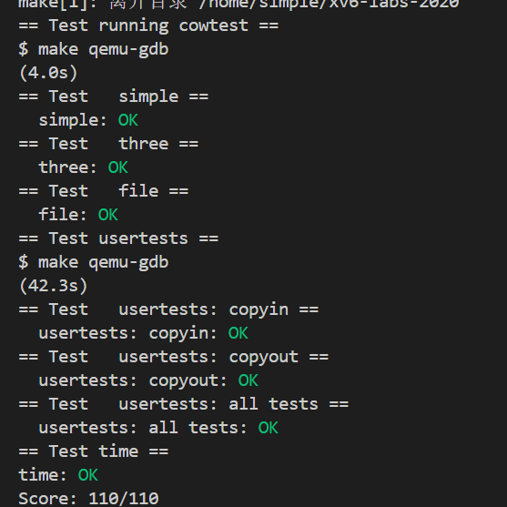

### 心得体会
完成 COW（写时复制）实验，我理解了高效内存复用的核心逻辑。通过定义 PTE_COW 标志，fork 时父子进程共享物理页并设为只读，仅当写入时触发缺页异常，再分配新页复制内容。实现中需维护物理页引用计数，通过 krefpage 增计数、kfree 减计数，确保页资源正确回收。调试时解决了引用计数竞态、页权限同步等问题，体会到 “延迟复制” 对内存效率的提升，也认识到内核需在共享与隔离、性能与安全间保持好平衡。


## thread实验
### switching的实现
#### 实现思路
(user/uthread_switch.S)  
实现 thread_switch 函数，接收两个 struct context* 类型参数（旧线程和新线程的上下文指针），通过汇编指令将当前线程的 ra、sp 及 s0-s11 寄存器值保存到旧线程的 ctx 中，再从新线程的 ctx 中恢复这些寄存器的值，最后通过 ret 指令跳转到新线程的 ra 地址继续执行。

(user/uthread.c)  
定义 struct context 结构体，包含 ra、sp 及 s0-s11 等被调用者保存寄存器，用于保存线程上下文。   
修改 struct thread 结构体，添加 struct context 类型的 ctx 成员以存储线程上下文。   
修改 thread_create 函数，为新线程分配栈空间，将 ctx.ra 设为线程函数地址，ctx.sp 设为栈顶地址（栈空间最高地址），并将线程置为就绪态。  
修改 thread_schedule 函数，当切换线程时，保存当前线程指针，更新当前线程为下一线程，调用 thread_switch 函数(该函数声明需要同步修改传参类型)并传入当前线程和下一线程的 ctx 指针。

#### 核心代码
```c
uthread_switch.S文件
thread_switch:
	/* YOUR CODE HERE */
	sd ra, 0(a0)
	sd sp, 8(a0)
	sd s0, 16(a0)
	sd s1, 24(a0)
	sd s2, 32(a0)
	sd s3, 40(a0)
	sd s4, 48(a0)
	sd s5, 56(a0)
	sd s6, 64(a0)
	sd s7, 72(a0)
	sd s8, 80(a0)
	sd s9, 88(a0)
	sd s10, 96(a0)
	sd s11, 104(a0)

	ld ra, 0(a1)
	ld sp, 8(a1)
	ld s0, 16(a1)
	ld s1, 24(a1)
	ld s2, 32(a1)
	ld s3, 40(a1)
	ld s4, 48(a1)
	ld s5, 56(a1)
	ld s6, 64(a1)
	ld s7, 72(a1)
	ld s8, 80(a1)
	ld s9, 88(a1)
	ld s10, 96(a1)
	ld s11, 104(a1)
	ret    /* return to ra */

uthread.c文件
struct context {
  uint64 ra; //返回地址(程序计数器PC)
  uint64 sp; //栈指针

  // 被调用者保存的寄存器
  uint64 s0;
  uint64 s1;
  uint64 s2;
  uint64 s3;
  uint64 s4;
  uint64 s5;
  uint64 s6;
  uint64 s7;
  uint64 s8;
  uint64 s9;
  uint64 s10;
  uint64 s11;
};
struct thread {
  char       stack[STACK_SIZE]; /* the thread's stack */
  int        state;             /* FREE, RUNNING, RUNNABLE */
  struct context ctx;  //线程上下文
};

extern void thread_switch(struct context* old, struct context* new);  //此处需要修改参数类型

void 
thread_schedule(void)
{
  ......
  if (current_thread != next_thread) {         /* switch threads?  */
    ......
    /* YOUR CODE HERE
     * Invoke thread_switch to switch from t to next_thread:
     * thread_switch(??, ??);
     */
    thread_switch(&t->ctx, &next_thread->ctx); // 切换到新线程
  } else
    next_thread = 0;
}

void 
thread_create(void (*func)())
{
  struct thread *t;

  for (t = all_thread; t < all_thread + MAX_THREAD; t++) {
    if (t->state == FREE) break;
  }
  t->state = RUNNABLE;
  // YOUR CODE HERE
  t->ctx.ra = (uint64)func;       // 设置线程入口
  // thread_switch 的结尾会返回到 ra，从而运行线程代码
  t->ctx.sp = (uint64)&t->stack + (STACK_SIZE - 1);  // 栈指针
}
```

#### 效果截图
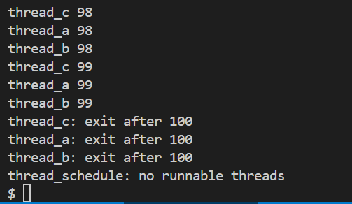


### using的实现
#### 实现思路
(notxv6/ph.c)   
声明一个与哈希桶数量相等的 pthread_mutex_t 数组 locks，用于为每个哈希桶单独加锁。   
在 main 函数中，初始化数组中每个锁（调用 pthread_mutex_init）。   
修改 put 函数，计算键对应的哈希桶索引后，对该桶的锁执行 pthread_mutex_lock，完成插入操作后执行 pthread_mutex_unlock。   
修改 get 函数，计算键对应的哈希桶索引后，对该桶的锁执行 pthread_mutex_lock，完成查询操作后执行 pthread_mutex_unlock。   

#### 核心代码
```c
ph.c文件
pthread_mutex_t locks[NBUCKET];   //锁声明

int
main(int argc, char *argv[])
{
  pthread_t *tha;
  void *value;
  double t1, t0;

  for(int i=0;i<NBUCKET;i++) {
    pthread_mutex_init(&locks[i], NULL); 
  }

  ......

}

static 
void put(int key, int value)
{
  int i = key % NBUCKET;
  pthread_mutex_lock(&locks[i]);       // 获取锁

  ......

  pthread_mutex_unlock(&locks[i]);     // 释放锁
}

static struct entry*
get(int key)
{
  int i = key % NBUCKET;

  pthread_mutex_lock(&locks[i]);       // 获取锁

  ......

  pthread_mutex_unlock(&locks[i]);     // 释放锁

  return e;
}
```

#### 测试截图
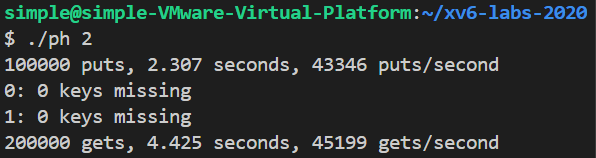

### Barrier的实现
#### 实现思路
(barrier.c)    
实现 barrier 函数，使用互斥锁保护临界区，将当前进入屏障的线程数加 1，若未达到总线程数则调用 pthread_cond_wait 进入等待状态并释放锁，待被唤醒时重新获取锁；若已达到总线程数则重置线程数为 0、轮数加 1，并调用 pthread_cond_broadcast 唤醒所有等待线程，最后释放锁。

#### 核心代码
```c
static void 
barrier()
{
  // YOUR CODE HERE
  //
  // Block until all threads have called barrier() and
  // then increment bstate.round.
  //
  pthread_mutex_lock(&bstate.barrier_mutex);
  if(++bstate.nthread < nthread) {
    pthread_cond_wait(&bstate.barrier_cond, &bstate.barrier_mutex);
  } else {
    bstate.nthread = 0;
    bstate.round++;
    pthread_cond_broadcast(&bstate.barrier_cond);
  }
  pthread_mutex_unlock(&bstate.barrier_mutex);
}
```

#### 测试截图
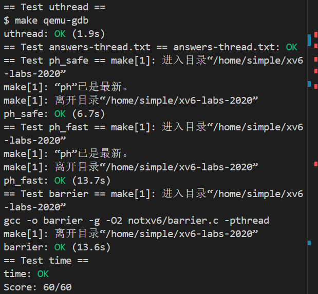

### 心得体会
完成 thread 实验，我掌握了用户级线程切换与同步的核心逻辑。实现线程切换时，通过汇编保存 / 恢复被调用者寄存器，精准控制线程上下文切换；用哈希桶锁实现并发安全，每个桶独立加锁提升效率；屏障则靠互斥锁计数、条件变量唤醒，确保线程同步执行。调试中解决了寄存器保存遗漏、锁释放时机错误等问题，深刻理解线程上下文、并发控制的本质，也体会到同步机制对线程安全的重要性。

## lock实验
### Memory allocator的实现
#### 实现思路
(kernel/kalloc.c)  
定义 kmem 数组，为每个 CPU 核心分配独立的内存管理结构，每个结构包含一个自旋锁和一个空闲页链表，实现物理内存的分区管理。  
初始化时，为每个 CPU 的 kmem 结构初始化锁，并将系统空闲物理内存范围添加到空闲链表中。  
在 kfree 函数中，释放物理页时，通过 cpuid() 获取当前 CPU 编号，将释放的页插入到当前 CPU 对应的空闲链表中，操作过程中使用该 CPU 专属的锁进行同步。  
在 kalloc 函数中，分配物理页时，优先从当前 CPU 的空闲链表中获取。若当前 CPU 空闲页不足，则逐个尝试从其他 CPU 的空闲链表中 “偷取” 最多 64 个页补充到当前 CPU 的链表中，偷取过程中需获取对应 CPU 的锁。  
整个分配和释放过程中，通过 push_off() 和 pop_off() 屏蔽和恢复中断，确保临界区操作不受中断干扰，增强同步安全性。

#### 核心代码
```c
kalloc.c文件
struct {
  struct spinlock lock;
  struct run *freelist;
} kmem[NCPU];

char *kmem_lock_names[] = {
  "kmem_cpu_0",
  "kmem_cpu_1",
  "kmem_cpu_2",
  "kmem_cpu_3",
  "kmem_cpu_4",
  "kmem_cpu_5",
  "kmem_cpu_6",
  "kmem_cpu_7",
};

void
kinit()
{
  for(int i=0;i<NCPU;i++) { // 所有锁都要初始化
    initlock(&kmem[i].lock, kmem_lock_names[i]);
  }
  freerange(end, (void*)PHYSTOP);
}

void
kfree(void *pa)
{
  ......

  push_off();

  int cpu = cpuid();

  acquire(&kmem[cpu].lock);
  r->next = kmem[cpu].freelist;
  kmem[cpu].freelist = r;
  release(&kmem[cpu].lock);

  pop_off();
}

void *
kalloc(void)
{
  struct run *r;

  push_off();

  int cpu = cpuid();

  acquire(&kmem[cpu].lock);

  if(!kmem[cpu].freelist) { // no page left for this cpu
    int steal_left = 64; // steal 64 pages from other cpu(s)
    for(int i=0;i<NCPU;i++) {
      if(i == cpu) continue; // no self-robbery
      acquire(&kmem[i].lock);
      struct run *rr = kmem[i].freelist;
      while(rr && steal_left) {
        kmem[i].freelist = rr->next;
        rr->next = kmem[cpu].freelist;
        kmem[cpu].freelist = rr;
        rr = kmem[i].freelist;
        steal_left--;
      }
      release(&kmem[i].lock);
      if(steal_left == 0) break; // done stealing
    }
  }

  r = kmem[cpu].freelist;
  if(r)
    kmem[cpu].freelist = r->next;
  release(&kmem[cpu].lock);

  pop_off();

  if(r)
    memset((char*)r, 5, PGSIZE); // fill with junk
  return (void*)r;
}
```

#### 测试截图
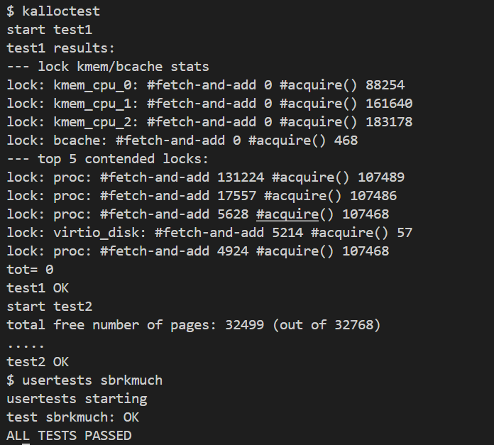

### Buffer cache的实现
#### 实现思路
(kernel/bio.c)
定义 struct buf 结构体，包含缓冲区的元数据（设备号、块号、有效性标识等）、同步锁（睡眠锁）、引用计数、最近使用时间及链表指针，用于管理磁盘块缓存。
定义 bcache 结构，包含缓冲区数组、换出操作的全局自旋锁，以及由哈希桶和对应桶锁组成的哈希表，实现缓存的分区管理与高效查找。
初始化函数 binit 中，初始化所有哈希桶的锁和链表头，将所有缓冲区初始化为未使用状态并放入第一个哈希桶，同时初始化换出锁。
在 bget 函数中，获取缓冲区时，先通过哈希函数定位目标哈希桶，检查缓存是否命中。若命中则增加引用计数并返回锁定的缓冲区；若未命中，释放当前桶锁并获取换出锁再次检查，仍未命中则遍历所有哈希桶，采用 LRU 策略选择可重用的缓冲区，将其迁移到目标哈希桶并更新元数据后返回。
释放缓冲区的 brelse 函数中，释放缓冲区的睡眠锁，减少引用计数，当引用计数为 0 时更新最近使用时间。
bpin 和 bunpin 函数通过增减引用计数实现缓冲区的固定（防止被换出）与解除固定，操作时需获取对应哈希桶的锁进行同步。
整个过程通过哈希桶锁减少并发竞争，通过换出锁避免换出过程中的冲突，通过睡眠锁确保缓冲区的独占访问，兼顾缓存效率与同步安全性。

#### 核心代码
```c
bio.c文件
// bucket number for bufmap
#define NBUFMAP_BUCKET 13
// hash function for bufmap
#define BUFMAP_HASH(dev, blockno) ((((dev)<<27)|(blockno))%NBUFMAP_BUCKET)

struct {
  struct buf buf[NBUF];
  struct spinlock eviction_lock;

  // Hash map: dev and blockno to buf
  struct buf bufmap[NBUFMAP_BUCKET];
  struct spinlock bufmap_locks[NBUFMAP_BUCKET];
} bcache;

void
binit(void)
{
  // Initialize bufmap
  for(int i=0;i<NBUFMAP_BUCKET;i++) {
    initlock(&bcache.bufmap_locks[i], "bcache_bufmap");
    bcache.bufmap[i].next = 0;
  }

  // Initialize buffers
  for(int i=0;i<NBUF;i++){
    struct buf *b = &bcache.buf[i];
    initsleeplock(&b->lock, "buffer");
    b->lastuse = 0;
    b->refcnt = 0;
    // put all the buffers into bufmap[0]
    b->next = bcache.bufmap[0].next;
    bcache.bufmap[0].next = b;
  }

  initlock(&bcache.eviction_lock, "bcache_eviction");
}

// Look through buffer cache for block on device dev.
// If not found, allocate a buffer.
// In either case, return locked buffer.
static struct buf*
bget(uint dev, uint blockno)
{
  struct buf *b;

  uint key = BUFMAP_HASH(dev, blockno);

  acquire(&bcache.bufmap_locks[key]);

  // Is the block already cached?
  for(b = bcache.bufmap[key].next; b; b = b->next){
    if(b->dev == dev && b->blockno == blockno){
      b->refcnt++;
      release(&bcache.bufmap_locks[key]);
      acquiresleep(&b->lock);
      return b;
    }
  }

  // Not cached.

  // to get a suitable block to reuse, we need to search for one in all the buckets,
  // which means acquiring their bucket locks.
  // but it's not safe to try to acquire every single bucket lock while holding one.
  // it can easily lead to circular wait, which produces deadlock.

  release(&bcache.bufmap_locks[key]);
  // we need to release our bucket lock so that iterating through all the buckets won't
  // lead to circular wait and deadlock. however, as a side effect of releasing our bucket
  // lock, other cpus might request the same blockno at the same time and the cache buf for  
  // blockno might be created multiple times in the worst case. since multiple concurrent
  // bget requests might pass the "Is the block already cached?" test and start the 
  // eviction & reuse process multiple times for the same blockno.
  //
  // so, after acquiring eviction_lock, we check "whether cache for blockno is present"
  // once more, to be sure that we don't create duplicate cache bufs.
  acquire(&bcache.eviction_lock);

  // Check again, is the block already cached?
  // no other eviction & reuse will happen while we are holding eviction_lock,
  // which means no link list structure of any bucket can change.
  // so it's ok here to iterate through `bcache.bufmap[key]` without holding
  // it's cooresponding bucket lock, since we are holding a much stronger eviction_lock.
  for(b = bcache.bufmap[key].next; b; b = b->next){
    if(b->dev == dev && b->blockno == blockno){
      acquire(&bcache.bufmap_locks[key]); // must do, for `refcnt++`
      b->refcnt++;
      release(&bcache.bufmap_locks[key]);
      release(&bcache.eviction_lock);
      acquiresleep(&b->lock);
      return b;
    }
  }

  // Still not cached.
  // we are now only holding eviction lock, none of the bucket locks are held by us.
  // so it's now safe to acquire any bucket's lock without risking circular wait and deadlock.

  // find the one least-recently-used buf among all buckets.
  // finish with it's corresponding bucket's lock held.
  struct buf *before_least = 0; 
  uint holding_bucket = -1;
  for(int i = 0; i < NBUFMAP_BUCKET; i++){
    // before acquiring, we are either holding nothing, or only holding locks of
    // buckets that are *on the left side* of the current bucket
    // so no circular wait can ever happen here. (safe from deadlock)
    acquire(&bcache.bufmap_locks[i]);
    int newfound = 0; // new least-recently-used buf found in this bucket
    for(b = &bcache.bufmap[i]; b->next; b = b->next) {
      if(b->next->refcnt == 0 && (!before_least || b->next->lastuse < before_least->next->lastuse)) {
        before_least = b;
        newfound = 1;
      }
    }
    if(!newfound) {
      release(&bcache.bufmap_locks[i]);
    } else {
      if(holding_bucket != -1) release(&bcache.bufmap_locks[holding_bucket]);
      holding_bucket = i;
      // keep holding this bucket's lock....
    }
  }
  if(!before_least) {
    panic("bget: no buffers");
  }
  b = before_least->next;
  
  if(holding_bucket != key) {
    // remove the buf from it's original bucket
    before_least->next = b->next;
    release(&bcache.bufmap_locks[holding_bucket]);
    // rehash and add it to the target bucket
    acquire(&bcache.bufmap_locks[key]);
    b->next = bcache.bufmap[key].next;
    bcache.bufmap[key].next = b;
  }
  
  b->dev = dev;
  b->blockno = blockno;
  b->refcnt = 1;
  b->valid = 0;
  release(&bcache.bufmap_locks[key]);
  release(&bcache.eviction_lock);
  acquiresleep(&b->lock);
  return b;
}

// ......

// Release a locked buffer.
void
brelse(struct buf *b)
{
  if(!holdingsleep(&b->lock))
    panic("brelse");

  releasesleep(&b->lock);

  uint key = BUFMAP_HASH(b->dev, b->blockno);

  acquire(&bcache.bufmap_locks[key]);
  b->refcnt--;
  if (b->refcnt == 0) {
    b->lastuse = ticks;
  }
  release(&bcache.bufmap_locks[key]);
}

void
bpin(struct buf *b) {
  uint key = BUFMAP_HASH(b->dev, b->blockno);

  acquire(&bcache.bufmap_locks[key]);
  b->refcnt++;
  release(&bcache.bufmap_locks[key]);
}

void
bunpin(struct buf *b) {
  uint key = BUFMAP_HASH(b->dev, b->blockno);

  acquire(&bcache.bufmap_locks[key]);
  b->refcnt--;
  release(&bcache.bufmap_locks[key]);
}
```

#### 测试截图
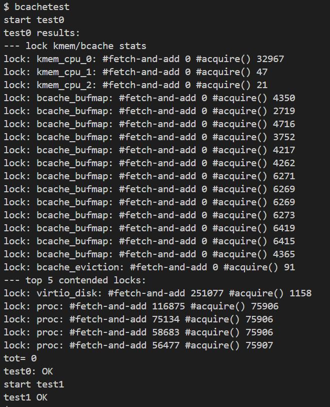

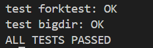

### 心得体会
完成此次 lock 实验，我理解了内核中并发控制与资源管理的核心逻辑。实现内存分配时，为每个 CPU 设独立空闲页链表，优先本地分配、不足时跨 CPU “偷取”，通过自旋锁和关中断保障安全；缓冲区缓存用哈希桶锁减少竞争，LRU 策略换出旧缓存，睡眠锁实现独占访问。调试中解决了锁竞争死锁、缓存重复创建等问题，体会到细粒度锁对并发效率的提升，也认识到内核需在资源复用与同步安全间寻找适当的平衡。

## File System实验
### Large files的实现

#### 实现思路
(kernel/fs.h)    
调整直接索引数量，将 NDIRECT 从 12 改为 11。    
更新 MAXFILE 计算方式，包含 11 个直接索引、256 个一级索引及 256×256 个二级索引。   
将 struct dinode 和 struct inode 的 addrs 数组长度改为 NDIRECT+2，用于存储直接、一级、二级索引块号。     

(kernel/fs.c)     
修改 bmap 函数，按块号范围处理：块号小于 11 时使用直接索引；11 到 266 之间通过一级索引块查找或分配；大于等于 266 时先经二级索引块找到对应一级索引块，再从中查找或分配。    
修改 itrunc 函数，依次释放直接索引块、一级索引块及其中数据块、二级索引块及关联的一级索引块和数据块，最后重置 inode 大小并更新磁盘 inode。


#### 核心代码
```c
fs.h文件
#define NDIRECT 11 //12改为11
#define NINDIRECT (BSIZE / sizeof(uint))
#define MAXFILE (NDIRECT + NINDIRECT + NINDIRECT * NINDIRECT)

// On-disk inode structure
struct dinode {
  short type;           // File type
  short major;          // Major device number (T_DEVICE only)
  short minor;          // Minor device number (T_DEVICE only)
  short nlink;          // Number of links to inode in file system
  uint size;            // Size of file (bytes)
  uint addrs[NDIRECT+2];   // Data block addresses  NDIRECT+1改为+2
};

fs.c文件
static uint
bmap(struct inode *ip, uint bn)
{
  uint addr, *a;
  struct buf *bp;

  if(bn < NDIRECT){
    if((addr = ip->addrs[bn]) == 0)
      ip->addrs[bn] = addr = balloc(ip->dev);
    return addr;
  }
  bn -= NDIRECT;

  if(bn < NINDIRECT){ // singly-indirect
    // Load indirect block, allocating if necessary.
    if((addr = ip->addrs[NDIRECT]) == 0)
      ip->addrs[NDIRECT] = addr = balloc(ip->dev);
    bp = bread(ip->dev, addr);
    a = (uint*)bp->data;
    if((addr = a[bn]) == 0){
      a[bn] = addr = balloc(ip->dev);
      log_write(bp);
    }
    brelse(bp);
    return addr;
  }
  bn -= NINDIRECT;

  if(bn < NINDIRECT * NINDIRECT) { // doubly-indirect
    // Load indirect block, allocating if necessary.
    if((addr = ip->addrs[NDIRECT+1]) == 0)
      ip->addrs[NDIRECT+1] = addr = balloc(ip->dev);
    bp = bread(ip->dev, addr);
    a = (uint*)bp->data;
    if((addr = a[bn/NINDIRECT]) == 0){
      a[bn/NINDIRECT] = addr = balloc(ip->dev);
      log_write(bp);
    }
    brelse(bp);
    bn %= NINDIRECT;
    bp = bread(ip->dev, addr);
    a = (uint*)bp->data;
    if((addr = a[bn]) == 0){
      a[bn] = addr = balloc(ip->dev);
      log_write(bp);
    }
    brelse(bp);
    return addr;
  }

  panic("bmap: out of range");
}

// Truncate inode (discard contents).
// Caller must hold ip->lock.
void
itrunc(struct inode *ip)
{
  int i, j;
  struct buf *bp;
  uint *a;

  for(i = 0; i < NDIRECT; i++){
    if(ip->addrs[i]){
      bfree(ip->dev, ip->addrs[i]);
      ip->addrs[i] = 0;
    }
  }

  if(ip->addrs[NDIRECT]){
    bp = bread(ip->dev, ip->addrs[NDIRECT]);
    a = (uint*)bp->data;
    for(j = 0; j < NINDIRECT; j++){
      if(a[j])
        bfree(ip->dev, a[j]);
    }
    brelse(bp);
    bfree(ip->dev, ip->addrs[NDIRECT]);
    ip->addrs[NDIRECT] = 0;
  }

  if(ip->addrs[NDIRECT+1]){
    bp = bread(ip->dev, ip->addrs[NDIRECT+1]);
    a = (uint*)bp->data;
    for(j = 0; j < NINDIRECT; j++){
      if(a[j]) {
        struct buf *bp2 = bread(ip->dev, a[j]);
        uint *a2 = (uint*)bp2->data;
        for(int k = 0; k < NINDIRECT; k++){
          if(a2[k])
            bfree(ip->dev, a2[k]);
        }
        brelse(bp2);
        bfree(ip->dev, a[j]);
      }
    }
    brelse(bp);
    bfree(ip->dev, ip->addrs[NDIRECT+1]);
    ip->addrs[NDIRECT + 1] = 0;
  }

  ip->size = 0;
  iupdate(ip);
}
```

#### 测试截图
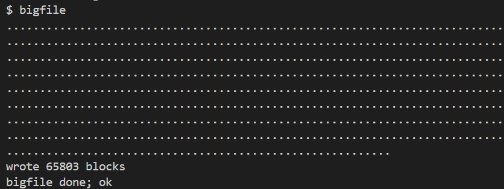

### Symbolic links的实现
#### 实现思路
(kernel/syscall.h)   
定义 SYS_symlink 系统调用号（如 #define SYS_symlink 22），用于标识符号链接系统调用。

(user/usys.pl)   
添加 entry("symlink"); 条目，生成用户态到内核态的 symlink 系统调用入口代码。

(user/user.h)   
声明 symlink 函数原型 int symlink(const char*, const char*);，供用户程序调用。

(kernel/stat.h)   
添加符号链接文件类型定义 #define T_SYMLINK 4，与其他文件类型（T_FILE、T_DIR 等）区分。    

(kernel/fcntl.h)    
定义 O_NOFOLLOW 标志（如 #define O_NOFOLLOW 0x800），用于 open 系统调用控制是否跟随符号链接。

(kernel/sysfile.c)    
实现 sys_symlink 函数：通过 argstr 获取目标路径和链接路径；调用 create 创建 T_SYMLINK 类型 inode；使用 writei 将目标路径写入 inode 的第一个数据块（包含终止符）；处理错误并返回结果。
修改 sys_open 函数：在非创建文件分支中，添加递归跟随符号链接逻辑，通过循环检查 inode 类型，若为符号链接且未设置 O_NOFOLLOW，则读取链接目标路径并更新路径变量，限制递归深度防止循环；若设置 O_NOFOLLOW 则直接打开符号链接本身；处理目录文件打开权限，确保符合访问规则。

(kernel/syscall.c)    
在系统调用表 syscalls 中添加 [SYS_symlink] sys_symlink, 映射，关联系统调用号与实现函数。

#### 核心代码
```c
sysfile.c文件
uint64
sys_symlink(void)
{
  struct inode *ip;
  char target[MAXPATH], path[MAXPATH];
  if(argstr(0, target, MAXPATH) < 0 || argstr(1, path, MAXPATH) < 0)
    return -1;

  begin_op();

  ip = create(path, T_SYMLINK, 0, 0);
  if(ip == 0){
    end_op();
    return -1;
  }

  // use the first data block to store target path.
  if(writei(ip, 0, (uint64)target, 0, strlen(target)) < 0) {
    end_op();
    return -1;
  }

  iunlockput(ip);

  end_op();
  return 0;
}

uint64
sys_open(void)
{
  char path[MAXPATH];
  int fd, omode;
  struct file *f;
  struct inode *ip;
  int n;

  if((n = argstr(0, path, MAXPATH)) < 0 || argint(1, &omode) < 0)
    return -1;

  begin_op();

  if(omode & O_CREATE){
    ip = create(path, T_FILE, 0, 0);
    if(ip == 0){
      end_op();
      return -1;
    }
  } else {
    int symlink_depth = 0;
    while(1) { // recursively follow symlinks
      if((ip = namei(path)) == 0){
        end_op();
        return -1;
      }
      ilock(ip);
      if(ip->type == T_SYMLINK && (omode & O_NOFOLLOW) == 0) {
        if(++symlink_depth > 10) {
          // too many layer of symlinks, might be a loop
          iunlockput(ip);
          end_op();
          return -1;
        }
        if(readi(ip, 0, (uint64)path, 0, MAXPATH) < 0) {
          iunlockput(ip);
          end_op();
          return -1;
        }
        iunlockput(ip);
      } else {
        break;
      }
    }
    if(ip->type == T_DIR && omode != O_RDONLY){
      iunlockput(ip);
      end_op();
      return -1;
    }
  }

  // .......

  iunlock(ip);
  end_op();

  return fd;
}
```

#### 测试截图
测试截图1    
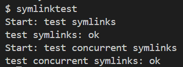    

测试截图2   
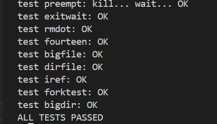

### 心得体会
完成文件系统实验，我深入理解了大文件存储与符号链接的实现逻辑。实现大文件时，通过调整索引结构，新增二级索引扩展存储范围，在 bmap 中分层处理不同块号，itrunc 按层级释放资源；实现符号链接需定义新文件类型与系统调用，open 函数递归跟随链接并限制深度防循环。调试中解决了索引越界、链接循环等问题，体会到文件系统层级设计的精妙。

## mmap实验
### mmap的实现
#### 实现思路
(kernel/memlayout.h)  
定义 MMAPEND 为 TRAPFRAME，作为 mmap 映射区域的结束地址（开区间），使 mmap 区域从高地址（TRAPFRAME 下方）向下生长，避免与进程已有地址空间冲突。  

(kernel/proc.h)   
定义 vma 结构体，包含映射的有效性、起始地址、大小、关联文件、权限、标志和文件偏移等信息。   
在 proc 结构体中添加 vmas 数组（含 16 个 vma 槽），用于存储进程的虚拟内存区域信息。   
  
(kernel/sysfile.c)   
实现 sys_mmap 函数：检查参数合法性与文件权限，查找空闲 vma 槽，计算映射地址（基于现有 vma 的最低地址下方），初始化 vma 信息并增加文件引用计数。   
实现 findvma 函数：根据虚拟地址查找对应的 vma。   
实现 vmatrylazytouch 函数：处理 mmap 页面的懒加载，在首次访问时分配物理页、从文件读取数据并建立页表映射，设置相应权限。  
实现 sys_munmap 函数：查找对应的 vma，检查释放范围合法性，调用 vmaunmap 释放指定页面，更新 vma 信息，必要时关闭文件并标记 vma 为无效。   

(kernel/trap.c)    
在 usertrap 中处理页面错误（异常码 13 或 15），调用 vmatrylazytouch 进行懒加载，若失败则标记进程为被杀死状态。    

(kernel/vm.c)   
实现 vmaunmap 函数：释放指定范围的物理页面，若页面被修改且为共享映射，则根据页面在 vma 中的位置（开头、中间、结尾）将数据写回文件，最后清除页表项。     

(kernel/riscv.h)    
添加 PTE_D（dirty bit）宏定义，用于检测页面是否被修改。

(kernel/proc.c)    
在 allocproc 中初始化进程的 vma 数组，标记所有 vma 槽为无效。   
在 freeproc 中释放进程所有 vma 映射的页面，清理页表和进程状态。    
在 fork 中拷贝父进程的 vma 信息并增加文件引用计数，子进程访问时重新触发懒加载。

#### 核心代码
```c
memlayout.h文件
......
// MMAP 所能使用的最后一个页+1
#define MMAPEND TRAPFRAME

proc.h文件

struct vma {
  int valid;
  uint64 vastart;
  uint64 sz;
  struct file *f;
  int prot;
  int flags;
  uint64 offset;
};

#define NVMA 16

// Per-process state
struct proc {
  struct spinlock lock;

  // p->lock must be held when using these:
  enum procstate state;        // Process state
  struct proc *parent;         // Parent process
  void *chan;                  // If non-zero, sleeping on chan
  int killed;                  // If non-zero, have been killed
  int xstate;                  // Exit status to be returned to parent's wait
  int pid;                     // Process ID

  // these are private to the process, so p->lock need not be held.
  uint64 kstack;               // Virtual address of kernel stack
  uint64 sz;                   // Size of process memory (bytes)
  pagetable_t pagetable;       // User page table
  struct trapframe *trapframe; // data page for trampoline.S
  struct context context;      // swtch() here to run process
  struct file *ofile[NOFILE];  // Open files
  struct inode *cwd;           // Current directory
  char name[16];               // Process name (debugging)
  struct vma vmas[NVMA];       // virtual memory areas
};

proc.c文件
static struct proc*
allocproc(void)
{
  // ......

  // Clear VMAs
  for(int i=0;i<NVMA;i++) {
    p->vmas[i].valid = 0;
  }

  return p;
}

// free a proc structure and the data hanging from it,
// including user pages.
// p->lock must be held.
static void
freeproc(struct proc *p)
{
  if(p->trapframe)
    kfree((void*)p->trapframe);
  p->trapframe = 0;
  for(int i = 0; i < NVMA; i++) {
    struct vma *v = &p->vmas[i];
    vmaunmap(p->pagetable, v->vastart, v->sz, v);
  }
  if(p->pagetable)
    proc_freepagetable(p->pagetable, p->sz);
  p->pagetable = 0;
  p->sz = 0;
  p->pid = 0;
  p->parent = 0;
  p->name[0] = 0;
  p->chan = 0;
  p->killed = 0;
  p->xstate = 0;
  p->state = UNUSED;
}

// Create a new process, copying the parent.
// Sets up child kernel stack to return as if from fork() system call.
int
fork(void)
{
  // ......

  // copy vmas created by mmap.
  // actual memory page as well as pte will not be copied over.
  for(i = 0; i < NVMA; i++) {
    struct vma *v = &p->vmas[i];
    if(v->valid) {
      np->vmas[i] = *v;
      filedup(v->f);
    }
  }

  safestrcpy(np->name, p->name, sizeof(p->name));

  pid = np->pid;

  np->state = RUNNABLE;

  release(&np->lock);

  return pid;
}

sysfile.c文件
uint64
sys_mmap(void)
{
  uint64 addr, sz, offset;
  int prot, flags, fd; struct file *f;

  if(argaddr(0, &addr) < 0 || argaddr(1, &sz) < 0 || argint(2, &prot) < 0
    || argint(3, &flags) < 0 || argfd(4, &fd, &f) < 0 || argaddr(5, &offset) < 0 || sz == 0)
    return -1;
  
  if((!f->readable && (prot & (PROT_READ)))
     || (!f->writable && (prot & PROT_WRITE) && !(flags & MAP_PRIVATE)))
    return -1;
  
  sz = PGROUNDUP(sz);

  struct proc *p = myproc();
  struct vma *v = 0;
  uint64 vaend = MMAPEND; // non-inclusive
  
  // mmaptest never passed a non-zero addr argument.
  // so addr here is ignored and a new unmapped va region is found to
  // map the file
  // our implementation maps file right below where the trapframe is,
  // from high addresses to low addresses.

  // Find a free vma, and calculate where to map the file along the way.
  for(int i=0;i<NVMA;i++) {
    struct vma *vv = &p->vmas[i];
    if(vv->valid == 0) {
      if(v == 0) {
        v = &p->vmas[i];
        // found free vma;
        v->valid = 1;
      }
    } else if(vv->vastart < vaend) {
      vaend = PGROUNDDOWN(vv->vastart);
    }
  }

  if(v == 0){
    panic("mmap: no free vma");
  }
  
  v->vastart = vaend - sz;
  v->sz = sz;
  v->prot = prot;
  v->flags = flags;
  v->f = f; // assume f->type == FD_INODE
  v->offset = offset;

  filedup(v->f);

  return v->vastart;
}

// find a vma using a virtual address inside that vma.
struct vma *findvma(struct proc *p, uint64 va) {
  for(int i=0;i<NVMA;i++) {
    struct vma *vv = &p->vmas[i];
    if(vv->valid == 1 && va >= vv->vastart && va < vv->vastart + vv->sz) {
      return vv;
    }
  }
  return 0;
}

// finds out whether a page is previously lazy-allocated for a vma
// and needed to be touched before use.
// if so, touch it so it's mapped to an actual physical page and contains
// content of the mapped file.
int vmatrylazytouch(uint64 va) {
  struct proc *p = myproc();
  struct vma *v = findvma(p, va);
  if(v == 0) {
    return 0;
  }

  // printf("vma mapping: %p => %d\n", va, v->offset + PGROUNDDOWN(va - v->vastart));

  // allocate physical page
  void *pa = kalloc();
  if(pa == 0) {
    panic("vmalazytouch: kalloc");
  }
  memset(pa, 0, PGSIZE);
  
  // read data from disk
  begin_op();
  ilock(v->f->ip);
  readi(v->f->ip, 0, (uint64)pa, v->offset + PGROUNDDOWN(va - v->vastart), PGSIZE);
  iunlock(v->f->ip);
  end_op();

  // set appropriate perms, then map it.
  int perm = PTE_U;
  if(v->prot & PROT_READ)
    perm |= PTE_R;
  if(v->prot & PROT_WRITE)
    perm |= PTE_W;
  if(v->prot & PROT_EXEC)
    perm |= PTE_X;

  if(mappages(p->pagetable, va, PGSIZE, (uint64)pa, PTE_R | PTE_W | PTE_U) < 0) {
    panic("vmalazytouch: mappages");
  }

  return 1;
}

uint64
sys_munmap(void)
{
  uint64 addr, sz;

  if(argaddr(0, &addr) < 0 || argaddr(1, &sz) < 0 || sz == 0)
    return -1;

  struct proc *p = myproc();

  struct vma *v = findvma(p, addr);
  if(v == 0) {
    return -1;
  }

  if(addr > v->vastart && addr + sz < v->vastart + v->sz) {
    // trying to "dig a hole" inside the memory range.
    return -1;
  }

  uint64 addr_aligned = addr;
  if(addr > v->vastart) {
    addr_aligned = PGROUNDUP(addr);
  }

  int nunmap = sz - (addr_aligned-addr); // nbytes to unmap
  if(nunmap < 0)
    nunmap = 0;
  
  vmaunmap(p->pagetable, addr_aligned, nunmap, v); // custom memory page unmap routine for mmapped pages.

  if(addr <= v->vastart && addr + sz > v->vastart) { // unmap at the beginning
    v->offset += addr + sz - v->vastart;
    v->vastart = addr + sz;
  }
  v->sz -= sz;

  if(v->sz <= 0) {
    fileclose(v->f);
    v->valid = 0;
  }

  return 0;  
}

trap.c文件
void
usertrap(void)
{
  int which_dev = 0;

  ......

  } else if((which_dev = devintr()) != 0){
    // ok
  } else {
    uint64 va = r_stval();
    if((r_scause() == 13 || r_scause() == 15)){ // vma lazy allocation
      if(!vmatrylazytouch(va)) {
        goto unexpected_scause;
      }
    } else {
      unexpected_scause:
      printf("usertrap(): unexpected scause %p pid=%d\n", r_scause(), p->pid);
      printf("            sepc=%p stval=%p\n", r_sepc(), r_stval());
      p->killed = 1;
    }
  }

  ......

  usertrapret();
}

vm.c文件
#include "fcntl.h"
#include "spinlock.h"
#include "sleeplock.h"
#include "file.h"
#include "proc.h"

// Remove n BYTES (not pages) of vma mappings starting from va. va must be
// page-aligned. The mappings NEED NOT exist.
// Also free the physical memory and write back vma data to disk if necessary.
void
vmaunmap(pagetable_t pagetable, uint64 va, uint64 nbytes, struct vma *v)
{
  uint64 a;
  pte_t *pte;

  // printf("unmapping %d bytes from %p\n",nbytes, va);

  // borrowed from "uvmunmap"
  for(a = va; a < va + nbytes; a += PGSIZE){
    if((pte = walk(pagetable, a, 0)) == 0)
      continue;
    if(PTE_FLAGS(*pte) == PTE_V)
      panic("sys_munmap: not a leaf");
    if(*pte & PTE_V){
      uint64 pa = PTE2PA(*pte);
      if((*pte & PTE_D) && (v->flags & MAP_SHARED)) { // dirty, need to write back to disk
        begin_op();
        ilock(v->f->ip);
        uint64 aoff = a - v->vastart; // offset relative to the start of memory range
        if(aoff < 0) { // if the first page is not a full 4k page
          writei(v->f->ip, 0, pa + (-aoff), v->offset, PGSIZE + aoff);
        } else if(aoff + PGSIZE > v->sz){  // if the last page is not a full 4k page
          writei(v->f->ip, 0, pa, v->offset + aoff, v->sz - aoff);
        } else { // full 4k pages
          writei(v->f->ip, 0, pa, v->offset + aoff, PGSIZE);
        }
        iunlock(v->f->ip);
        end_op();
      }
      kfree((void*)pa);
      *pte = 0;
    }
  }
}

riscv.h文件
#define PTE_G (1L << 5) // global mapping
#define PTE_A (1L << 6) // accessed
#define PTE_D (1L << 7) // dirty

```

#### 测试截图
mmaptest测试截图：   
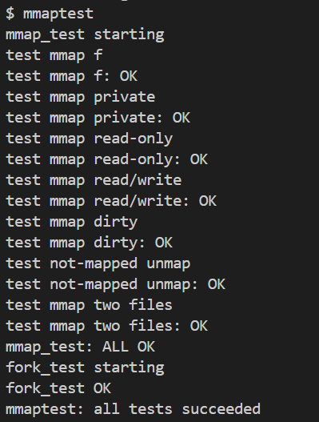

usertests测试截图：   
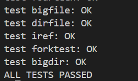

### 心得体会
完成 mmap 实验，我掌握了内存映射的核心机制。通过在进程结构体中添加 vma 管理虚拟内存区域，实现了文件到用户地址空间的映射。采用懒加载策略，首次访问时分配物理页并从文件读取数据，结合页错误处理完成映射。释放时根据共享标志决定是否写回文件，确保数据一致性。调试中解决了地址冲突、权限错误等问题，体会到 mmap 对用户态内存与文件交互的简化，也认识内核需在懒加载、权限控制和资源回收间平衡，提升内存管理能力。

## net实验
### networking的实现
#### 实现思路
#### 核心代码
```c
int
e1000_transmit(struct mbuf *m)
{
  acquire(&e1000_lock); // 获取 E1000 的锁，防止多进程同时发送数据出现 race

  uint32 ind = regs[E1000_TDT]; // 下一个可用的 buffer 的下标
  struct tx_desc *desc = &tx_ring[ind]; // 获取 buffer 的描述符，其中存储了关于该 buffer 的各种信息
  // 如果该 buffer 中的数据还未传输完，则代表我们已经将环形 buffer 列表全部用完，缓冲区不足，返回错误
  if(!(desc->status & E1000_TXD_STAT_DD)) {
    release(&e1000_lock);
    return -1;
  }
  
  // 如果该下标仍有之前发送完毕但未释放的 mbuf，则释放
  if(tx_mbufs[ind]) {
    mbuffree(tx_mbufs[ind]);
    tx_mbufs[ind] = 0;
  }

  // 将要发送的 mbuf 的内存地址与长度填写到发送描述符中
  desc->addr = (uint64)m->head;
  desc->length = m->len;
  // 设置参数，EOP 表示该 buffer 含有一个完整的 packet
  // RS 告诉网卡在发送完成后，设置 status 中的 E1000_TXD_STAT_DD 位，表示发送完成。
  desc->cmd = E1000_TXD_CMD_EOP | E1000_TXD_CMD_RS;
  // 保留新 mbuf 的指针，方便后续再次用到同一下标时释放。
  tx_mbufs[ind] = m;

  // 环形缓冲区内下标增加一。
  regs[E1000_TDT] = (regs[E1000_TDT] + 1) % TX_RING_SIZE;
  
  release(&e1000_lock);
  return 0;
}

static void
e1000_recv(void)
{
  while(1) { // 每次 recv 可能接收多个包

    uint32 ind = (regs[E1000_RDT] + 1) % RX_RING_SIZE;
    
    struct rx_desc *desc = &rx_ring[ind];
    // 如果需要接收的包都已经接收完毕，则退出
    if(!(desc->status & E1000_RXD_STAT_DD)) {
      return;
    }

    rx_mbufs[ind]->len = desc->length;
    
    net_rx(rx_mbufs[ind]); // 传递给上层网络栈。上层负责释放 mbuf

    // 分配并设置新的 mbuf，供给下一次轮到该下标时使用
    rx_mbufs[ind] = mbufalloc(0); 
    desc->addr = (uint64)rx_mbufs[ind]->head;
    desc->status = 0;

    regs[E1000_RDT] = ind;
  }

}
```

#### 测试截图
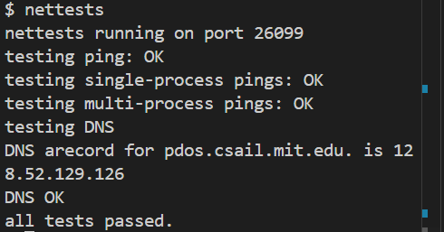

### 心得体会
完成 net 实验，我理解了网卡驱动与网络数据传输的核心逻辑。实现 E1000 网卡发送功能时，通过环形缓冲区管理发送队列，用锁保障多进程并发安全，检查描述符状态确保缓冲区可用，设置命令位触发硬件传输；接收功能则循环读取接收描述符，获取数据包后交给上层网络栈，及时分配新缓冲区供后续接收。调试中解决了缓冲区竞争、数据传输不完整等问题，体会到硬件与软件之间协同合作，也认识到环形缓冲区对高效数据交互的重要性。


## 所有实验结果汇总
util实验   
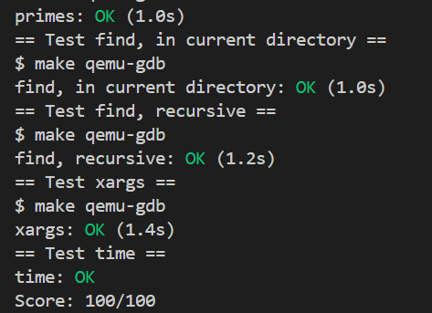

syscall实验   
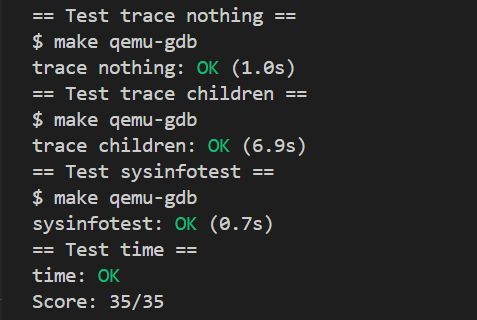

pgtbl实验   
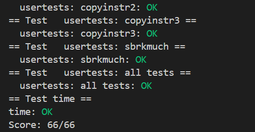

traps实验   
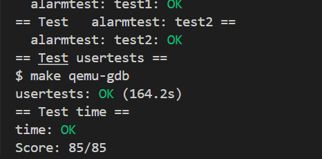

lazy实验  
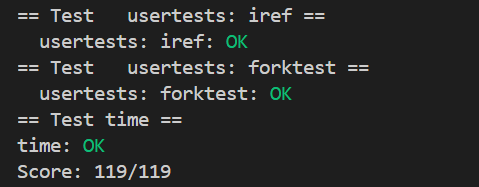

cow实验  
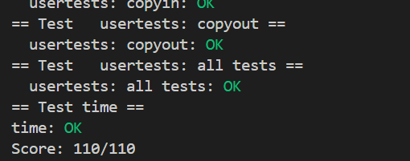

thread实验   
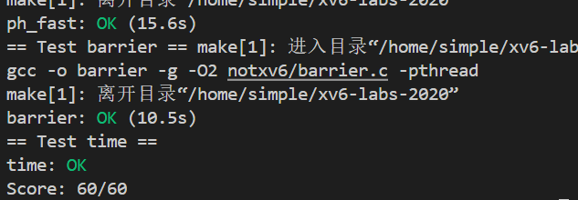

lock实验   
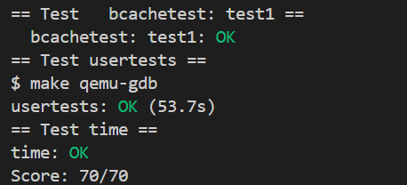

fs实验   


mmap实验  
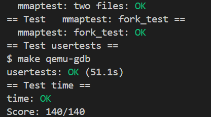

net实验   
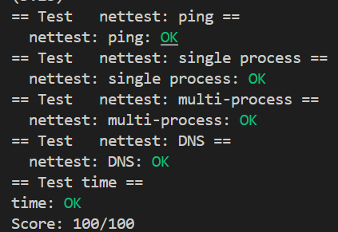